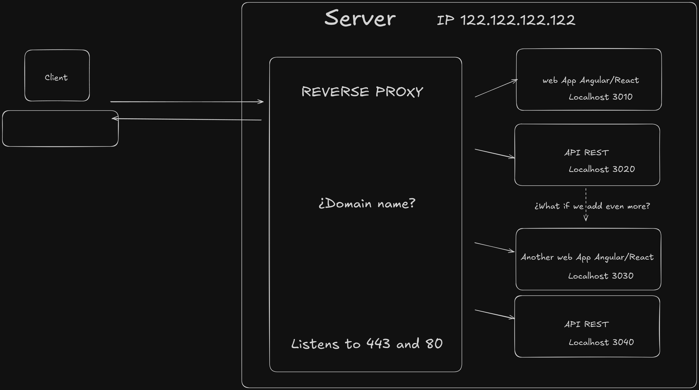

# INSTRUCCIONES PARA LA CONFIGURACIÓN DE UN SERVIDOR LINUX COMO SERVIDOR WEB NODE CON VARIOS SERVIDORES EXPRESS

## El problema

Cuando necesitamos ejecutar múltiples aplicaciones web Node.js/Express en un mismo servidor, nos encontramos con una limitación importante: los puertos estándar web.

Por convención, los navegadores web se conectan al puerto 80 para HTTP y al puerto 443 para HTTPS. Si intentamos ejecutar varias aplicaciones Express simultáneamente (por ejemplo, una aplicación Angular/React y una API), todas necesitarían escuchar estos mismos puertos.

<br/>


Esto genera un conflicto: ¿Qué aplicación debería responder a las peticiones entrantes?

Aunque configuremos diferentes dominios (por ejemplo, `www.midominioweb.com` para la aplicación frontend y `www.midominioapi.com` para la API), el problema persiste. Los dominios solo determinan a qué dirección IP se dirigen las peticiones, pero no especifican el puerto. Por lo tanto, no podemos asignar diferentes dominios a diferentes aplicaciones Express que escuchan en el mismo puerto.

## Las soluciones

- La primera solución sería contratar un servidor independiente para cada aplicación web. Sin embargo, esto resulta costoso e ineficiente desde el punto de vista de recursos y gestión.

- La segunda solución consiste en configurar las aplicaciones para que escuchen en diferentes puertos. Por ejemplo, mantener la aplicación principal React/Angular en el puerto 443 (accesible mediante `https://www.midominioweb.com`), mientras que la API escucharía en otro puerto (accesible mediante `https://www.midominioweb.com:3030`). Cuando no se especifica un puerto en la URL, el navegador utiliza por defecto el puerto 443 para HTTPS y el 80 para HTTP.

  Aunque esta solución podría funcionar inicialmente, presenta dos problemas importantes:

  1. No es profesional requerir que los usuarios finales incluyan números de puerto específicos en las URLs
  2. Complica significativamente la gestión y renovación de certificados SSL necesarios para HTTPS

- La solución recomendada es utilizar un servidor web que actúe como **Reverse Proxy**. Este servidor será el único que escuche en los puertos 443 y 80, y se encargará de reenviar las peticiones a diferentes servidores web que corren localmente en otros puertos (por ejemplo, 3010, 3011...). Estos servidores locales permanecen seguros al no estar expuestos directamente a Internet, ya que sus puertos no están abiertos en el firewall.

  Al combinar esta configuración con subdominios, podemos ofrecer múltiples servicios web a través de un único dominio principal:

  - `https://www.midominioweb.com` (frontend principal)
  - `https://api.midominioweb.com` (API)
  - `https://mywebapp2.midominioweb.com` (otra aplicación)

  El reverse proxy analiza el dominio de cada petición entrante y la redirige al servidor local correspondiente.

  Esta arquitectura es una solución probada que funciona perfectamente con gestores de certificados SSL como _certbot_, permitiendo la automatización completa del proceso de emisión y renovación de certificados.

  <br/>



<br/>

## El proceso de configuración

El proceso para configurar un servidor web desde cero va más allá de la configuración de un reverse proxy y múltiples servidores node corriendo de forma local. Pero tampoco mucho más allá. Vamos a cubrir el proceso completo ya que todos nos encontramos con tener que realizar el proceso completo y se agradece tener los pasos en una única guía.

Este proceso pretende configurar un servidor para que sea seguro y funcional para producción, por lo que te va a parecer que algunos pasos sean innecesarios, pero si se hacen es para mejorar la seguridad.

Es posible que te preguntes qué sistema operativo tener en el servidor. Mi recomendación es Ubuntu Server o Rocky Linux (Por su uso extendido) en su última versión LTS y SIN entorno de escritorio para no gastar recursos innecesariamente ya que las operaciones las vamos a realizar por la terminal.

Antes de adquirir o contratar el servidor, ya sea un VPS o una instancia cloud de un servidor, es MUY recomendable que estés preparado para seguir al menos los primeros pasos previos a la instalación de servicios web ya que una vez se levante el servidor puedes estar seguro que algún bot automático va a encontrar tu web y va a intentar loguearse por fuerza bruta usando usuarios por defecto (como root) y contraseñas comunes.

Es por esos que nuestros primeros pasos van encaminados a esto.

1. Encontrar y analizar los datos de acceso que nos han dado para acceder a nuestro servidor web.
2. Modificar los datos de acceso y la posibilidad de acceso desde cuentas conocidas (p.e. como 'root', 'admin', 'administrator'...)
3. Comprobar y Levantar el firewall con las excepciones necesarias para que podamos seguir conectándonos al servidor.
4. Actualizar --Hasta aquí las operaciones a realizar de forma urgente nada más levantar el servidor--
5. Instalar Node
6. Instalar NGINX (Nuestro Reverse Proxy)
7. Instalar MySQL o MongoDB o el servidor DB que vayamos a usar (Si los necesitamos)
8. Crear un usuario SIN PERMISOS SUDO que será el propietario de las carpetas donde estén contenidos nuestros servidores node.
9. Crear scripts BASH con los comandos para levantar los servidores node.
10. Crear servicios que ejecuten dichos scripts para que nuestros servidores node funcionen como servicios del servidor.
11. Configurar nuestros dominios y subdominios para que dirigan a nuestro servidor.
12. Configurar nuestro reverse proxy para que dirija las peticiones de cada dominio o subdominio a sus servidores locales node correspondientes.
13. Configurar certbot para que expida y además se quede encargado de renovar los certificados SSL cuando corresponda.
14. Comprobar todo (Servicios enabled, Reinicio del servidor con todo levantado automáticamente) y salir a pisar hierba.

## 1. ENCONTRAR Y ANALIZAR LOS DATOS DE ACCESO QUE NOS HAN DADO PARA ACCEDER A NUESTRO SERVIDOR WEB

Una vez hemos terminado el proceso de contratación al cabo de unos poco minutos nuestro servidor estará disponible para su acceso. Los datos de acceso nos los pueden mandar por email, u obtenerlos a través del panel de control de nuestro proovedor.

Debemos analizar cual es el nombre de usuario que nos han dado. Si por ejemplo es `root` tenemos un problema en cuanto a que `root` es un superusuario que está presente en todas las máquinas Linux, pero al que por seguridad muchas veces no se le da acceso remoto. Sin embargo, si nos han dado datos de acceso con `root` significa que este usuario SI tiene acceso remoto, y esto es problemático en cuanto a que los bots automáticos que buscan acceder por fuerza bruta a los servidores están constatemente buscando combinaciones de `root` con contraseñas, algunas sencillas como `1234` o `password`, otras un poco más complicadas, pero de forma constante.

Para poder acceder por fuerza bruta necesitan dar con tu usuario y contraseña. Si de alguna forma conocen tu usuario de acceso ya tienen la mitad del trabajo hecho. Puede que por ejemplo, conozcan el rango de IPs que tiene tu proovedor y que el acceso lo da con el usuario root, u otra circunstancia que les hace saber tu nombre de usuario. Es por ello de vital importancia que si tu proovedor te ha dado un nombre de usuario demasiado común, como `root`, `admin` o el nombre del provedor, como puede ser `arsys` o `hostinger` (No digo que esto proveedores usen esos nombre de usuario, son sólo ejemplos) es de vital importancia que o bien crees un nuevo usuario y quites acceso remoto al otro usuario.

Luego hay que analizar la constraseña, aunque esta hay que modificarla siempre. En realidad tanto usuario como contraseña es muy recomendable que se modifiquen. La diferencia o necesidad del análisis es la urgencia con la que debes realizar estas acciones. Con usuario `root` o `admin` o `administrator` el cambio es urgentísimo. Con usuario con un nombre común como el nombre del proovedor del servidor el cambio es urgente. Con un nombre de usuario con aspecto de ser aleatorio como `a12hjdMa` el cambio no sería tan urgente, pero igualmente recomendable.

Es posible que nuestro proovedor nos permita elegir el formato de acceso, ya que no óolo podemos acceder mediante usuario y contraseña. También podemos acceder mediante usuario y clave compartida, que deberíamos instalar en el ordenador. Como este caso es menos frecuente lo vamos a dejar aparte, aunque es un método más seguro pero con en inconveniente de tener que instalar la clave en todos los ordenadores desde los que se puede realizar el acceso.

Otro caso que se nos podría dar es que nos hayan dado un puerto específico para conectarnos de forma remota diferente del puerto por defecto. En ese caso, enhorabuena, tu servidor es bastante más seguro sólo por esto, aunque ahora el puerto es otro parámetro a recordar junto al usuario y contraseña. Pero primero vamos a explicar un poco cómo nos conectamos de forma remota para el que no esté familiarizado con SSH.

### La conexión remota mediante el servicio SSH

Para conectarnos de forma remota a nuestro servidor el proovedor habrá levantado el servidor con el servicio SSH habilitado. SSH significa _Secure Shell_ y nos permite desde cualquier terminal, como `Git Bash`, `CMD`, `PowerShell` o `Terminal Mac`, aunque también podemos usar un programa como `PuTTy` para realizar la conexión y tener la terminal. En todo caso, para poder conectarte vía SSH necesitas abrir un programa de terminal como los anteriormente mencionados.

Este servicio tiene por defecto un puerto de conexión: **El puerto 22**. Si nuestro proovedor no dice nada en los datos de acceso significa que usamos dicho puerto.
En ese caso podríamos conectarnos a nuestro servidor usando alguno de los siguiente nombres de usuario y direcciones fictícias

```Bash
ssh <tu nombre de usuario>@<la direccion de tu servidor>
```

por ejemplo

```Bash
ssh root@122.122.122.122
```

o usando un nombre de dominio:

```Bash
ssh root@sajkjsd-122.cloud.hostinger.com
```

Si la dirección es correcta inmediatamente nos solicitará la contraseña. CUIDADO ya que al escribir la contraseña NO SE MOSTRARÁN NI SIQUIERA CARACTERES OCULTOS para mejorar la seguridad en caso de que alguien pudiera ver tu pantalla que no tuviera ni siquiera el dato de la longitud de tu contraseña. Eso hace más fácil poder equivocarnos, así que se cuidadoso al introducir la contraseña, ya que no vas a poder ver nada de ella para saber si has introducido un caracter de más o de menos.

**Si nuestro proovedor nos ha dado un puerto específico distinto del 22 para SSH**

Entonces la conexión será así, por ejemplo, al puerto 2244:

```Bash
ssh -p 2244 root@122.122.122.122
```

**Es muy recomendable modificar el puerto de SSH a otro diferente al 22, pero esto es una operación muy delicada que nos puede dejar sin acceso al servidor, por lo que hay que tomar medidas de seguridad**

Como hemos dicho, el puerto 22 es el puerto por defecto. Pues bien, tu servidor con dicho puerto abierto va a tener unos 5-6 intentos de acceso, la mayoría con intento de usuario root, a nuestro servidor.

Si modificamos ese puerto nos quitamos la molestia de recibir todos esos ataques de fuerza bruta y le quitamos esa carga al servidor.

Pero hay que hacerlo con mucho cuidado.

1- Es recomendable asegurarnos de que a través de nuestro proovedor tenemos acceso via consola o KVM, que es básicamente un acceso remoto pero a través del panel de control, siendo para nuestro servidor como un acceso no remoto y por tanto no a través de SSH. Debemos para eso buscar en el panel de control eso: KVM, o Acceso Consola, O Consola Virtual... algo similar. Probamos y vemos si podemos iniciar sesión en nuestro servidor con nuestro usuario y contraseña por esta vía.

2- Si no es así, es más peligroso, ya que de ir mál las cosas te cerrarías todo accesos y quizás no te queda otra que reinstalar todo de 0 incluyendo el servidor con su sistema operativo, etc.

3- Lo primero que haremos es elegir un puerto libre que no use ningún servicio conocido. No puedo recomendar ninguno, pero investiga un poco para tomar tu decisión asegurándote que es un puerto libre de uso actualmente y en un futuro si es posible también. Evita puertos de servicios comunes como servidores de BBDD, y otros servicios comunes.

4- Luego debemos abrir dicho puerto en nuestro firewall con `sudo ufw allow <TuNumeroDePuerto>/tcp`

5- Después vamos a modificar la configuración del servicio ssh haciendo `sudo nano /etc/ssh/sshd_config` y buscando una línea que pone `# Port 22` que vamos a cambiar por `Port <TuNumeroDePuerto>` p.e. `Port 61234` (Es un ejemplo, no tengo ni idea de si es un buen puerto para usar) y vamos a guardar el archivo usando Ctrl + W y a cerrar el archivo con Ctrl + X.

6- Ahora debemos reiniciar el servicio. Primero vamos a recargar el daemon, ya que suele dar problemas para reiniciar ssh, y luego reiniciamos el servicio ssh y después vemos el status, donde nos indicará el puerto en el que está escuchando:

```bash
sudo systemctl daemon-reload
sudo systemctl restart ssh
sudo systemctl status ssh
```

Si tenemos un mensaje como este, con el puerto que hemos fijado, es que va bien y el servicio escucha en el puerto que hemos fijado si lo pone en el status donde está el cuadrado rojo.


En mi caso veo que el servicio ssh está casi bien, pero no está enabled, lo cual es un problema ya que no se iniciará en un reinicio, dejándome fuera salvo por acceso por consola virtual.

así que me falta habilitar el servicio ssh

```bash
sudo systemctl enable ssh
```

7- Una vez hecho esto debemos abrir desde nuestro ordenador OTRA consola sin cerrar la actual para no perder la conexión. Con la nueva consola intentamos en acceso ssh por el nuevo puerto: p.e

```Bash
ssh -p 2244 root@122.122.122.122
```

Si todo va bién y tenemos acceso estamos listos para cerrar el puerto 22.

8- Ahora desde la segunda consola vamos a deshabilitar el acceso del firewall al puerto 22:

```Bash
sudo ufw delete allow 22/tcp
```

Y con eso hemos cerrado el puerto.

podemos comprobarlo con:

```Bash
sudo ufw status
```

A partir de ahora ya debemos de acceder sólo a través del nuevo puerto y ya no veremos tantos intentos de acceso a nuestro servidor.

## 2. MODIFICAR LOS DATOS DE ACCESO

Para mejorar la seguridad de nuestro servidor, seguiremos estos pasos:

#### 2.1 Crear un nuevo usuario con privilegios de administrador (Sudo)

Primero, crearemos un nuevo usuario con privilegios _sudo_. Para poder crear un usuario _sudo_ nuestro usuario actual debe tener a su vez privilegios _sudo_. Por ello debemos añadir delante del comando a realizar la palabra `sudo`. Es posible que nos solicite contraseña `sudo` al ir a realizar la acción. Es la misma contraseña del usuario que usaste para el acceso. Como excepción, el usuario `root` no necesita añadir el comando sudo.

```bash
# Crear nuevo usuario
sudo adduser tunuevousuario

# Añadir al grupo sudo
sudo usermod -aG sudo tunuevousuario
```

LLegado este punto es recomendable probar si tienes acceso SSH mediante este nuevo usuario. O bien cierra la terminal actual y abre una nuevo, o usa el comando `exit` y luego vuelve a usar el comando

#### 2.2 Configurar SSH para mayor seguridad

Editaremos el archivo de configuración SSH usando el editor Nano:

```bash
sudo nano /etc/ssh/sshd_config
```

Realizaremos los siguientes cambios en dicho archivo de texto. Busca la línea que ya hay escrita con el nombre del parámetro a configurar y modifícala. NO AGREGUES UNA NUEVA LÍNEA CON LA INSTRUCCIÓN. Debes modificar la línea existente.

```text:/etc/ssh/sshd_config
# Deshabilitar acceso root
PermitRootLogin no

# Deshabilitar autenticación por contraseña (opcional, solo si usas claves SSH - SI NO ES IMPORTANTE DEJARLO EN yes)
PasswordAuthentication yes

# Cambiar puerto SSH (opcional pero recomendado - MUY IMPORTANTE - El número es a modo de ejemplo.
# Debes buscar tu propio puerto. Simplemente asegúrate que está disponible -
# consulta el listado del enlace)
Port 2244
```

A la hora de cambiar el puerto SSH recuerda 2 cosas: Anotar bien el puerto. No usar un puerto que esté usando otro servicio.

[Te dejo un listado con los puertos más comunes para que evites usarlos si te decides cambiar el puerto SSH](https://www.stationx.net/common-ports-cheat-sheet/)

#### 2.3 Reiniciar el servicio SSH

```bash
sudo systemctl restart sshd
```

#### 2.4 Verificar acceso con el nuevo usuario

Antes de cerrar la sesión actual, abre una nueva terminal y verifica que puedes acceder con el nuevo usuario:

```bash
ssh -p 2244 tunuevousuario@tu-ip-servidor
```

⚠️ **IMPORTANTE**:

- No cierres la sesión original hasta confirmar que puedes acceder con el nuevo usuario
- Guarda el nuevo puerto SSH si lo has cambiado
- Si usas un firewall, asegúrate de permitir el nuevo puerto SSH:

```bash
sudo ufw allow 2244/tcp
```

#### 2.5 Deshabilitar usuarios innecesarios (opcional, pero, de nuevo, recomendable)

Si quieres deshabilitar usuarios como 'admin' o 'administrator' para mejorar la seguridad y evitar que se puedan conectar via SSH:

```bash
sudo passwd -l nombreusuario
```

Esto bloqueará la cuenta sin eliminarla.

## 3. COMPROBAR Y LEVANTAR EL FIREWALL

El firewall es una parte esencial de la seguridad de nuestro servidor. En Ubuntu Server, utilizaremos UFW (Uncomplicated Firewall), que viene preinstalado pero generalmente desactivado.

### 3.1 Verificar el estado del firewall

```bash
sudo ufw status
```

Si aparece como "inactive", necesitaremos configurarlo.

### 3.2 Configuración básica del firewall

Antes de activar el firewall, debemos asegurarnos de permitir las conexiones SSH para no quedarnos fuera del servidor:

```bash
# Si usamos el puerto SSH por defecto (22)
sudo ufw allow 22/tcp

# Si hemos cambiado el puerto SSH (ejemplo: 2244)
sudo ufw allow 2244/tcp
```

### 3.3 Activar el firewall

```bash
sudo ufw enable
```

⚠️ **IMPORTANTE**: Asegúrate de haber permitido el acceso SSH antes de activar el firewall.

### 3.4 Reglas básicas recomendadas

```bash
# Denegar todo el tráfico entrante por defecto
sudo ufw default deny incoming

# Permitir todo el tráfico saliente por defecto
sudo ufw default allow outgoing

# Permitir HTTP
sudo ufw allow 80/tcp

# Permitir HTTPS
sudo ufw allow 443/tcp
```

### 3.5 Verificar las reglas configuradas

```bash
sudo ufw status verbose
```

### 3.6 Comandos útiles adicionales

**(NO PARA USAR AHORA, como referencia)**

```bash
# Eliminar una regla
sudo ufw delete allow 80/tcp

# Recargar las reglas
sudo ufw reload

# Desactivar el firewall (no recomendado en producción)
sudo ufw disable
```

### 3.7 Comprueba si tu proovedor no usa otro firewall configurable desde el panel de control

Es posible que tu proovedor use una capa adicional de firewall. Es buena práctica entonces usar ambos firewalls ya que si se cae el firewall externo no vas a tener ningún aviso y tu web quedaría desprotegida.

Si tu proveedor usa dicho firewall externo vas a tener que permitir el tráfico interno y externo del nuevo puerto SSH y de cualquier otro servicio que agregues. Si es un servidor web comprueba que los puertos 80 y 443 están abiertos para entrada y salida.

### 3.8 🛟 Si te has quedado bloqueado fuera del servidor 🛟

Puede que accidentalmente de hayas quedado bloqueado fuera del servidor. No desperes, a todos nos ha pasado, y no todo está perdido.

En este caso vas a tener que volver al panel de control de tu proveedor y comprobar si no tienen otro tipo de acceso que llamen "Acceso por Panel" o "Remoto". Esto nos permitiría acceder mediante un escritorio remoto como si estuviéramos físicamente delante del monitor del servidor, por lo que no importaría la configuración del firewall o de SSH. Eso si, debemos conocer nuestro usuario y contraseña. Desde aquí podríamos acceder y modificar las configuraciones del SSH o del firewall que nos han bloqueado acceso al servidor.

Si no hay dicho acceso... entonces, tendrás que usar la opción del panel de control que te permita reinstalar el servidor y comenzar el proceso de nuevo.

Si no hay nada de esto, ponte en contacto con el proveedor para que te vuelva a dejar el servidor reinstalado con las configuraciones por defecto.

### 3.9 ⚠️ **NOTAS IMPORTANTES**:

- Siempre verifica dos veces que has permitido el acceso SSH antes de activar el firewall

- Si necesitas acceder a otros servicios (como bases de datos), recuerda abrir los puertos correspondientes.

  Aunque **mi recomendación es que NO habras dichos puertos en el caso de Bases de Datos siempre que tu API esté alojada en el mismo servidor** que tu bbdd, ya que va a realizar una conexión local y no necesita exponerse a internet, que siempre es un riesgo si no es necesario.

- Es recomendable mantener el número de puertos abiertos al mínimo necesario

- Considera usar rangos de IPs permitidas para servicios críticos si es posible

## 4. ACTUALIZAR EL SISTEMA

Vamos a aplicar las actualizaciones pendientes por si hay algún parche de seguridad disponible que se deba aplicar. Para ello vamos a realizar `update` de `apt` (aptitude) que es el gestor de paquetes de `Ubuntu` y después `upgrade` para aplicar las actualizaciones. El gestor de paquetes de Rocky Linux es `dfn`, aunque aquí solo voy a presentar la instalación con `apt` no debería de diferenciarse mucho si se usa `dfn`.

```bash
sudo apt update && upgrade -y
```

Es posible y recomendable que tengamos que reiniciar el sistema

```bash
sudo reboot
```

## 5. INSTALAR NODE

Para instalar Node.js en nuestro servidor, tenemos varias opciones. La recomendada es usar el gestor de versiones NVM (Node Version Manager) que nos permitirá instalar y gestionar múltiples versiones de Node.js. Esto a su vez nos va a permitir poder levantar servidores con distintas versiones de Node dentro de un mismo servidor.

### 5.1 Instalar NVM

Primero, descargamos y ejecutamos el script bash de la instalación de NVM con la última versión, pero es recomendable que consultes el [repositorio de nvm](https://github.com/nvm-sh/nvm/) para averiguar cual es la última versión actual de nvm.

```bash
curl -o- https://raw.githubusercontent.com/nvm-sh/nvm/v0.40.1/install.sh | bash
```

Después de instalar reiniciamos la terminal o ejecutamos para que se refresque y poder tener disponible el comando `nvm`:

```bash
source ~/.bashrc
```

### 5.2 Verificar la instalación de NVM

```bash
nvm --version
```

### 5.3 Instalar Node.js

Para instalar la última versión LTS de node (recomendada para producción):

```bash
nvm install --lts
```

O si necesitas una versión específica:

```bash
nvm install 20.11.1  # Por ejemplo, para instalar la versión 20.11.1
```

O si quieres instalar la última versión 22 (Opción de uso recomendable para cuando necesites varias versiones de Node):

```bash
nvm install 22  # Por ejemplo, para instalar la versión 22.##.#
```

Node utiliza como versiones LTS los números pares. Actualmente las LTS son la 22, la 20 sigue en mantenimiento y la 18 está en proceso de ser deprecada y de dejar de mantenerse. Es recomendable usar estas versiones de Node porque siguen recibiendo actualizaciones de seguridad.

### 5.4 Verificar la instalación

```bash
node --version
npm --version
```

### 5.5 Comandos útiles de NVM

```bash
nvm ls                 # Listar versiones instaladas
nvm use 16.20.0        # Cambiar a una versión específica
nvm use 20             # Cambiar a la última versión LTS instalada que comience con 20
nvm current            # Ver versión actual en uso
```

## 6. INSTALAR NGINX

NGINX será nuestro servidor reverse proxy que gestionará todas las peticiones entrantes y las redirigirá a nuestros servidores Node.js locales.

### 6.1 Instalación de NGINX

```bash
# Actualizamos el repositorio para tener la última versión
sudo apt update

# Instalamos NGINX
sudo apt install nginx -y
```

Esto ejecutará el instalador con las opciones por defecto, que son las necesarias para nuestro uso. NGINX se instalará como un servicio de nuestro servidor. Para interactuar con este servicio y con todos los servicios instalados en el servidor usaremos la herramienta `systemctl`

### 6.2 Verificar la instalación

```bash
# Comprobar el estado del servicio
sudo systemctl status nginx
```

Debería salir un texto con un punto verde donde nos dice si el servicio está funcionando, si está `enabled` (Es decir, si está habilitado y por tanto se iniciará automáticamente con cada reinicio del sistema) y las últimas salidas de consola de la aplicación.

### 6.3 Comandos básicos de gestión

```bash
# Iniciar NGINX
sudo systemctl start nginx

# Detener NGINX
sudo systemctl stop nginx

# Reiniciar NGINX
sudo systemctl restart nginx

# Recargar la configuración sin detener el servicio (Últil cuando hemos realizado modificaciones de configuración y queremos que se ejecuten sin reiniciar el servicio)
sudo systemctl reload nginx

# Habilitar NGINX para que se inicie con el sistema
sudo systemctl enable nginx
```

### 6.4 Verificar el firewall

Asegúrate de que NGINX puede recibir tráfico permitiendo los puertos HTTP y HTTPS (En teoría este paso ya lo deberíamos haber realizado, pero no está de más asegurarse permitiendo acceso a la aplicación a través del firewall):

```bash
sudo ufw allow 'Nginx Full'
```

### 6.5 Verificar la instalación y funcionamiento

Abre un navegador y visita la IP de tu servidor. Deberías ver la página de bienvenida por defecto de NGINX. En este momento ya tendrías el servidor web de NGINX funcionando.

## 7. INSTALAR EL SERVIDOR DE BASE DE DATOS

La elección del servidor de base de datos dependerá de las necesidades específicas de tu proyecto. Aquí cubriremos la instalación tanto de MySQL como de MongoDB, que son las opciones más comunes.

### 7.1 Instalación de MySQL

```bash
# Actualizar repositorios
sudo apt update

# Instalar MySQL Server
sudo apt install mysql-server -y

# Iniciar el servicio MySQL
sudo systemctl start mysql

# Habilitar MySQL para que inicie con el sistema
sudo systemctl enable mysql

# Ejecutar el script de seguridad de MySQL
sudo mysql_secure_installation
```

Durante la ejecución de `mysql_secure_installation`, se te harán varias preguntas:

- Configurar la validación de contraseña (recomendado: Y)
- Nivel de validación de contraseña (recomendado: 2)
- Cambiar la contraseña de root
- Eliminar usuarios anónimos (recomendado: Y)
- Deshabilitar acceso root remoto (recomendado: Y)
- Eliminar base de datos de prueba (recomendado: Y)
- Recargar privilegios (recomendado: Y)

### 7.2 Instalación de MongoDB

[Instrucciones de instalación oficiales](https://www.mongodb.com/docs/manual/tutorial/install-mongodb-on-ubuntu/)

```bash
# Importar la clave pública de MongoDB
curl -fsSL https://www.mongodb.org/static/pgp/server-8.0.asc | \
   sudo gpg -o /usr/share/keyrings/mongodb-server-8.0.gpg \
   --dearmor

# Crear archivo de lista del repositorio en Ubuntu 24 para MongoDB (Consulta la guía para otras versiones)
echo "deb [ arch=amd64,arm64 signed-by=/usr/share/keyrings/mongodb-server-8.0.gpg ] https://repo.mongodb.org/apt/ubuntu noble/mongodb-org/8.0 multiverse" | sudo tee /etc/apt/sources.list.d/mongodb-org-8.0.list

# Actualizar el repositorio
sudo apt update

# Instalar MongoDB
sudo apt install -y mongodb-org

# Iniciar el servicio MongoDB
sudo systemctl start mongod

# Habilitar MongoDB para que inicie con el sistema
sudo systemctl enable mongod
```

### 7.3 Verificación de la instalación

Para MySQL:

```bash
# Verificar estado del servicio
sudo systemctl status mysql

# Verificar versión
mysql --version
```

Para MongoDB:

```bash
# Verificar estado del servicio
sudo systemctl status mongod

# Verificar versión
mongod --version
```

### 7.4 Consideraciones de seguridad importantes

#### 7.4.1 **Acceso remoto**:

Por defecto, tanto MySQL como MongoDB solo escuchan conexiones locales (127.0.0.1). Es recomendable mantener esta configuración si tu API está en el mismo servidor.

#### 7.4.2 **Puertos y Firewall**:

SI aún así quieres dar acceso externo, por seguridad, es recomendable cambiar los puertos por defecto de las bases de datos:

Para MySQL (cambiar puerto 3306):

```bash
# Editar la configuración de MySQL
sudo nano /etc/mysql/mysql.conf.d/mysqld.cnf

# Buscar o añadir la línea:
port = 3307  # O el puerto que prefieras

# Reiniciar MySQL
sudo systemctl restart mysql
```

Para MongoDB (cambiar puerto 27017):

```bash
# Editar la configuración de MongoDB
sudo nano /etc/mongod.conf

# Buscar la sección net: y modificar el puerto:
net:
  port: 27018  # O el puerto que prefieras

# Buscar la sección bindIp y modificar la ip a la que se escucha:

bindIp: \* # Escuchará a todas las ips
bindIp: 127.0.0.1 # Escuchará solo al propio servidor de manera local

# Reiniciar MongoDB

sudo systemctl restart mongod
```

Después deberás abrir los nuevos puertos en tu firewall:

```bash
# Para MySQL (ejemplo con puerto 3307)
sudo ufw allow 3307/tcp

# Para MongoDB (ejemplo con puerto 27018)
sudo ufw allow 27018/tcp
```

---

⚠️ **IMPORTANTE**:

- Documenta los nuevos puertos en un lugar seguro
- Actualiza la configuración de conexión en tus aplicaciones
- Considera usar un puerto no estándar para dificultar el escaneo automático
- Aun así, es preferible mantener el acceso solo a nivel local

---

#### 7.4.3 **Usuarios y permisos**: Crea usuarios específicos para tus aplicaciones con los mínimos privilegios necesarios:

Para MySQL:

```bash
sudo mysql
```

```sql
CREATE USER 'tuusuario'@'localhost' IDENTIFIED BY 'tucontraseña';
GRANT ALL PRIVILEGES ON tubasededatos.* TO 'tuusuario'@'localhost';
FLUSH PRIVILEGES;
```

Para MongoDB:

```bash
mongosh
```

```javascript
use admin
db.createUser({
  user: "tuusuario",
  pwd: "tucontraseña",
  roles: [{ role: "readWrite", db: "tubasededatos" }]
})
```

⚠️ **IMPORTANTE**:

- Usa contraseñas fuertes y únicas
- Evita usar el usuario root/admin para las aplicaciones
- Mantén las bases de datos actualizadas con los últimos parches de seguridad
- Realiza backups regulares
- Si es posible, mantén las conexiones solo a nivel local (localhost / 127.0.0.1)

#### 7.4.4 **MySQL: Realiza las operaciones necesarias para crear la estructura (y datos si ya tuvieras) de las bases de datos de tus aplicaciones**:

Si ya tienes una base de datos creada en tu ordenador es el momento de exportar su estructura y datos via consulta SQL y transferirla al servidor usando SFTP (Mismo acceso que SSH, puerto incluido si lo has modificado) para poder ejecutarla en el servidor para que te cree la base de datos y los datos que hayas exportado.

El usuario sería el usuario de base de datos que has creado en el punto anterior para esta base de datos. No confundir con el usuario del sistema que vamos a crear en el siguiente punto.

```bash
# Primero crear la base de datos si no existe
mysql -u tuusuariodebasededatos -p -e "CREATE DATABASE IF NOT EXISTS nombre_base_datos;"

# Luego importar el archivo
mysql -u tuusuariodebasededatos -p nombre_base_datos < backup.sql
```

## 8. CREAR USUARIO SIN PRIVILEGIOS PARA LOS SERVIDORES NODE Y ESTRUCTURA DE CARPETAS

Por razones de seguridad, es una buena práctica ejecutar nuestros servidores Node.js bajo un usuario sin privilegios de administrador. Esto limita el daño potencial en caso de que una de nuestras aplicaciones sea comprometida.

### 8.1 Crear el nuevo usuario (modifica nodeuser por el nombre que prefieras)

```bash
# Crear usuario sin directorio home
sudo useradd --no-create-home nodeuser

# O si prefieres crear el directorio home (opcional)
sudo useradd --create-home nodeuser

# Establecer una contraseña (aunque no la necesitaremos para ejecutar servicios)
sudo passwd nodeuser
```

### 8.2 Crear y configurar el directorio para las aplicaciones

```bash
# Crear directorio para las aplicaciones
sudo mkdir -p /var/www/nodeapps

# Establecer nodeuser como propietario
sudo chown -R nodeuser:nodeuser /var/www/nodeapps

# Establecer permisos adecuados
sudo chmod -R 755 /var/www/nodeapps
```

### 8.3 Verificar la configuración

```bash
# Verificar propietario y permisos
ls -la /var/www/nodeapps

# Probar acceso como nodeuser
sudo -u nodeuser ls -la /var/www/nodeapps
```

### 8.4 Consideraciones importantes

- El usuario `nodeuser` no podrá ejecutar comandos con `sudo`
- Solo podrá acceder y modificar archivos dentro de `/var/www/nodeapps`
- A la hora de transferir archivos via SFTP a `/var/www/nodeapps` es recomendable usar `nodeuser` para que ese usuario sea el propietario de esos archivos transferidos.
- Los servicios de Node.js se ejecutarán bajo este usuario
- Para realizar operaciones que requieran más privilegios, deberás usar tu usuario con privilegios sudo

### 8.5 Estructura recomendada de directorios (modificar myapp# por el nombre que identifique tu proyecto)

Vamos a crear, aparte de nuestros directorios que contendrán los proyectos webs, un directorio donde guardaremos los scripts que inicio del servicio web para cada proyecto.

```bash
/var/www/nodeapps/
├── myapp1/
│   ├── src/
│   └── node_modules/
├── myapp2/
│   ├── src/
│   └── node_modules/
└── start_scripts
```

Para crear esta estructura:

```bash
# Crear directorios para las aplicaciones
sudo -u nodeuser mkdir -p /var/www/nodeapps/myapp1
sudo -u nodeuser mkdir -p /var/www/nodeapps/myapp2
sudo -u nodeuser mkdir -p /var/www/nodeapps/start_scripts

# Verificar la estructura
tree /var/www/nodeapps
```

Ya te quedaría transferir los proyectos a cada carpeta usando sftp y utilizando `nodeuser` como usuario con el que realizar la conexión y transferencia para que sea el propietario de dichos archivos.

## 9. CREAR SCRIPTS BASH PARA INICIAR LOS SERVIDORES NODE

Los scripts bash nos ayudarán a gestionar el inicio de nuestras aplicaciones Node.js de manera consistente y organizada. Crearemos un script para cada aplicación que necesitemos ejecutar.

### 9.1 Crear los scripts de inicio

Para cada aplicación, crearemos un script bash en el directorio `/var/www/nodeapps/start_scripts` que nos va a permitir especificar la versión de node que queremos usar con nuestra aplicación.

```bash
# Crear script para la primera aplicación
sudo nano /var/www/nodeapps/start_scripts/start_myapp1.sh
```

Contenido del script (ajusta según tu aplicación - la primera línea le dice al sistema que es un script de bash):

```bash:start_myapp1.sh
#!/bin/bash

# Definir el comando nvm dentro del script
export NVM_DIR="$HOME/.nvm"
[ -s "$NVM_DIR/nvm.sh" ] && \. "$NVM_DIR/nvm.sh"

# Establecer la versión de Node.js
nvm use 20  # O la versión que necesites

# Iniciar la aplicación con el comando node o npm que necesites.
node /var/www/nodeapps/myapp1/src/index.js
```

Alternativamente, si quieres guardar y gestionar logs puedes sacar la salida por consola y los errores a un archivo modificando la última línea por la siguiente:

```bash
# Iniciar la aplicación
node /var/www/nodeapps/myapp1/src/index.js >> /var/www/nodeapps/myapp1.log 2>&1
```

Pero en este caso recuerda que debes de gestionar estos archivos de algún modo ya van a crecer sin límite.

En todo caso, si no estableces una salida a log vas a poder consultar igualmente logs de errores en `journalctl`, pero estos se suelen limitar en tamaño y días. Por lo que se borrarán automáticamente pasados varios días y no ocuparán cualquier tamaño

Puedes consultar la configuración actual de `journalctl` así:

```bash
# Ver la configuración actual del systemd-journald
sudo systemctl show systemd-journald
```

### 9.2 Configurar permisos

```bash
# Dar permisos de ejecución al script
sudo chmod +x /var/www/nodeapps/start_scripts/start_myapp1.sh

# Asignar propiedad a nodeuser
sudo chown nodeuser:nodeuser /var/www/nodeapps/start_scripts/start_myapp1.sh
```

### 9.3 Probar el script, para ver si arranca el servidor

```bash
# Ejecutar el script como nodeuser
sudo -u nodeuser /var/www/nodeapps/start_scripts/start_myapp1.sh
```

## 10. CREAR SERVICIOS SYSTEMD PARA LOS SERVIDORES NODE

Para asegurarnos de que nuestras aplicaciones Node.js se ejecuten automáticamente al iniciar el servidor y se reinicien en caso de fallo, crearemos servicios systemd para cada una de ellas.

### 10.1 Crear el archivo de servicio

Para cada aplicación, crearemos un archivo de servicio en `/etc/systemd/system/`:

```bash
sudo nano /etc/systemd/system/myapp1.service
```

Contenido del archivo de servicio:

```ini:/etc/systemd/system/myapp1.service
[Unit]
Description=MyApp1 Web Server
After=network.target

[Service]
User=nodeuser
ExecStart=/var/www/nodeapps/start_scripts/start_myapp1.sh
Restart=always

[Install]
WantedBy=multi-user.target
```

### 10.2 Explicación de las opciones del servicio

- `Description`: Descripción del servicio
- `After`: Indica que el servicio debe iniciarse después de que la red esté disponible
- `User`: Usuario bajo el cual se ejecutará el servicio
- `ExecStart`: Ruta al script que inicia la aplicación
- `Restart`: Política de reinicio (always = reiniciar siempre que el servicio se detenga)
- `WantedBy`: Momento en que se inicia el servicio. (Cuando el sistema alcanza estado multi-usuario - los usuarios pueden iniciar sesión en el sistema - Necesario para inicio automático )

### 10.3 Habilitar y gestionar el servicio

```bash
# Recargar la configuración de systemd para que cargue el fichero creado
sudo systemctl daemon-reload

# Iniciar el servicio
sudo systemctl start myapp1.service

# Habilitar el servicio para que se inicie con el sistema
sudo systemctl enable myapp1.service

```

Otros comandos útiles para gestionar el servicio

```bash
# Parar el servicio
sudo systemctl stop myapp1.service

# Verificar el estado del servicio
sudo systemctl status myapp1.service
```

### 10.4 Comandos útiles para gestionar el servicio

```bash
# Detener el servicio
sudo systemctl stop myapp1.service

# Reiniciar el servicio
sudo systemctl restart myapp1.service

# Ver los logs del servicio -hay que desplazarse abajo para ver los más recientes-
sudo journalctl -u myapp1.service
```

## 11. CONFIGURAR DOMINIOS Y SUBDOMINIOS

Para que nuestros dominios y subdominios apunten a nuestro servidor, necesitamos configurar los registros DNS correspondientes. Este proceso se realiza a través del panel de control de tu proveedor de dominios.

Allí encontrás una sección de DNS/Nameservers donde puedes editar los registros actuales de un dominio concreto y agregar los necesarios. Es posible que ya tengas un A con nombre @ que tendrás que editar y luego agregar un A con nombre `api` o el subdominio.

Recuerda consultar los existentes antes de agregar para no duplicar registros. Si en un futuro migras el servidor de hosting recuerda volver aquí para modificar los registros apuntando a la nueva IP.

### 11.1 Tipos de registros DNS necesarios

#### Registro A (Recomendado por contestar más rápido)

- Apunta un dominio o subdominio directamente a una dirección IP
- Es el tipo de registro más común y sirve tanto para el dominio principal como para subdominios
- Es más rápido en resolver que CNAME

```text
Tipo: A
Nombre: @
IP: 123.123.123.123
TTL: 3600

# Subdominio usando registro A
Tipo: A
Nombre: api
IP: 123.123.123.123
TTL: 3600
```

#### Registro CNAME (Como alternativa a usar un tipo A para un subdominio - NO USES AMBOS PARA UN SUBDOMINIO, uno u otro)

- Apunta un subdominio a otro dominio
- Útil para crear múltiples subdominios
- Si cambias el principal, el CNAME no hay que modificarlo, ya que CNAME se ajusta a un A principal.

```text
Tipo: CNAME
Nombre: api         // Creará api.tudominio.com
Destino: @         // Apunta al dominio principal
```

### 11.2 Configuración típica para una web con dominio principal y con API como subdominio usando CNAME

Por ejemplo, para configurar `midominio.com` y `api.midominio.com`:

```text
# Dominio principal
Tipo: A
Nombre: @
IP: 123.123.123.123
TTL: 300

# Subdominio www
Tipo: CNAME
Nombre: www
Destino: @
TTL: 300

# Subdominio API
Tipo: CNAME
Nombre: api
Destino: @
TTL: 300
```

### 11.3 Consideraciones importantes

- Los cambios en DNS pueden tardar hasta 48 horas en propagarse globalmente (TTL - Time To Live) pero generalmente tardan unos pocos minutos.
- Es recomendable empezar con un TTL bajo (100-300 segundos) durante la configuración inicial por si tienes que hacer un cambio que la propagación tarde poco.
- Una vez estable, puedes aumentar el TTL (3600 segundos es una configuración común)

## 12. CONFIGURAR NGINX COMO REVERSE PROXY

LLegados a este punto debemos tener nuestros servicios node corriendo de forma local y nuestro servidor web NGINX devolviendo la web por defecto.

Para comprobar si los node ya están corriendo correctamente podemos abrir momentáneamente su puerto en el firewall y comprobar con el navegador si está funcionando dirigiendonos al dominio y directamente al puerto del node.

```bash
# Para poder acceder al node que corre en el 3010
sudo ufw allow 3010/tcp
```

Luego con el navegador abrimos la dirección y el puerto con http `http://midominio.com:3010`

Una vez comprobado debemos volver a cerrar el puerto

```bash
sudo ufw delete allow 3010/tcp
```

Ahora vamos a hacer que NGINX actue como reverse proxy, y que sea él el que redirija las peticiones entrantes a los diferentes servidores Node.js según el dominio o subdominio solicitado.

### 12.1 Estructura de configuración de NGINX simple

Podemos seguir dos estructuras, podemos modificar el archivo de configuración actual directamente o agregar archivos de configuración individuales.

El primer método es válido para un servidor con pocos servicios node, el segundo es recomendable para mantener todo mejor si el servidor crece.

Con el primero vamos a editar el archivo de configuración y agregar nuestros servidores

Primero realizaremos una copia de seguridad del archivo de configurarción

```bash
sudo cp /etc/nginx/sites-available/default /etc/nginx/sites-available/default-backup
```

Luego abrimos con nano el archivo de configuración

```bash
sudo nano /etc/nginx/sites-available/defaul
```

Vamos a llegar a la línea donde dice `#Default server configuration` y vamos a insertar por encima (dejando por encima y por debajo de esta línea todo intacto a modo de referencia) nuestra configuración de un servidor escuchando al puerto 80:

```text
server {
	listen 80;
	server_name www.midominio.com midominio.com;

	location / {
            proxy_pass http://localhost:3010;
            proxy_http_version 1.1;
            proxy_read_timeout 300;
            proxy_connect_timeout 300;
            proxy_set_header Upgrade $http_upgrade;
            proxy_set_header Connection 'upgrade';
            proxy_set_header Host $host;
            proxy_cache_bypass $http_upgrade;
        }
}
```

con esto hemos configurado las peticiones que lleguen desde la dirección del navegador http://www.midominio.com con y sin www para que se dirijan al node corriendo en 3010. Ahora queremos que también las https se dirijan al mismo. Añadimos debajo de la llave de cierre otro bloque pero para el puerto 443.

```text
server {
	listen 443 http2;
	server_name www.midominio.com midominio.com;

	location / {
            proxy_pass http://localhost:3010;
            proxy_http_version 1.1;
            proxy_read_timeout 300;
            proxy_connect_timeout 300;
            proxy_set_header Upgrade $http_upgrade;
            proxy_set_header Connection 'upgrade';
            proxy_set_header Host $host;
            proxy_cache_bypass $http_upgrade;
        }
}
```

Ya hemos añadido la configuración para el dominio principal y su subdominio www. Ahora vamos añadir la configuración para el subdominio api.midominio.com hacia el node corriendo en el puerto 3020 de la misma forma, pero teniendo cuidado de AGREGARLA POR ENCIMA del principal para que el reenvío se ejecute antes del principal.

```text
server {
	listen 80;
	server_name api.midominio.com;

	location / {
            proxy_pass http://localhost:3020;
            proxy_http_version 1.1;
            proxy_read_timeout 300;
            proxy_connect_timeout 300;
            proxy_set_header Upgrade $http_upgrade;
            proxy_set_header Connection 'upgrade';
            proxy_set_header Host $host;
            proxy_cache_bypass $http_upgrade;
        }
}

server {
	listen 443 http2;
	server_name api.midominio.com;

	location / {
            proxy_pass http://localhost:3020;
            proxy_http_version 1.1;
            proxy_read_timeout 300;
            proxy_connect_timeout 300;
            proxy_set_header Upgrade $http_upgrade;
            proxy_set_header Connection 'upgrade';
            proxy_set_header Host $host;
            proxy_cache_bypass $http_upgrade;
        }
}
```

Guardamos el archivo y verificamos y recargamos la configuración de nginx para que se carguen los cambios.

```bash
# Verificar que la sintaxis es correcta
sudo nginx -t

# Recargar NGINX para aplicar cambios
sudo systemctl reload nginx
```

### 12.2 Estructura de configuración de NGINX más escalable

La configuración de NGINX se organiza en varios directorios:

```bash
/etc/nginx/
├── nginx.conf              # Configuración principal
├── sites-available/        # Configuraciones de sitios disponibles
└── sites-enabled/         # Enlaces simbólicos a configuraciones activas
```

Para cada aplicación, crearemos un archivo de configuración en sites-available dejando intacto el archivo de `/etc/nginx/sites-available/default`. En este caso crearemos un archivo en esa misma carpeta con el nombre de la aplicación:

```bash
sudo nano /etc/nginx/sites-available/myapp1
```

Y escribimos la configuración básica para una aplicación web:

```nginx:/etc/nginx/sites-available/myapp1
server {
    listen 80;
    server_name midominio.com www.midominio.com;

    location / {
        proxy_pass http://localhost:3010;  # Puerto donde escucha tu app Node
        proxy_http_version 1.1;
        proxy_set_header Upgrade $http_upgrade;
        proxy_set_header Connection 'upgrade';
        proxy_set_header Host $host;
        proxy_cache_bypass $http_upgrade;
    }
}

server {
	listen 443 http2;
	server_name midominio.com www.midominio.com;

	location / {
            proxy_pass http://localhost:3010;
            proxy_http_version 1.1;
            proxy_read_timeout 300;
            proxy_connect_timeout 300;
            proxy_set_header Upgrade $http_upgrade;
            proxy_set_header Connection 'upgrade';
            proxy_set_header Host $host;
            proxy_cache_bypass $http_upgrade;
        }
}
```

Para una API en subdominio api.midominio.com:

```bash
sudo nano /etc/nginx/sites-available/myapp1-api
```

```nginx:/etc/nginx/sites-available/myapp1-api
server {
    listen 80;
    server_name api.midominio.com;

    location / {
        proxy_pass http://localhost:3020;  # Puerto donde escucha tu API
        proxy_http_version 1.1;
        proxy_set_header Upgrade $http_upgrade;
        proxy_set_header Connection 'upgrade';
        proxy_set_header Host $host;
        proxy_cache_bypass $http_upgrade;
    }
}

server {
	listen 443 http2;
	server_name api.midominio.com;

	location / {
            proxy_pass http://localhost:3020;
            proxy_http_version 1.1;
            proxy_read_timeout 300;
            proxy_connect_timeout 300;
            proxy_set_header Upgrade $http_upgrade;
            proxy_set_header Connection 'upgrade';
            proxy_set_header Host $host;
            proxy_cache_bypass $http_upgrade;
        }
}
```

#### Activar las configuraciones

Crear enlaces simbólicos en sites-enabled para activar esas configuración:

```bash
sudo ln -s /etc/nginx/sites-available/myapp1 /etc/nginx/sites-enabled/
sudo ln -s /etc/nginx/sites-available/myapp1-api /etc/nginx/sites-enabled/
```

#### Verificar y recargar la configuración

```bash
# Verificar que la sintaxis es correcta
sudo nginx -t

# Recargar NGINX para aplicar cambios
sudo systemctl reload nginx
```

Y así, siguiendo este proceso de añadir archivo de configuración y habilitar al incluir su enlace simbólico en la carpeta `sites-enabled` podemos ir incluyendo posteriores servidores web node a los que reenviar las peticiones.

### 12.3 Mejoras en el servidor

Podemos incluir configuraciones como añadir compresión u otras para mejorar el rendimiento

```nginx:/etc/nginx/sites-available/myapp1
server {
    # ... configuración básica ...

    # Habilitar compresión gzip (Recomendable)
    gzip on;
    gzip_types text/plain text/css application/json application/javascript text/xml application/xml application/xml+rss text/javascript;
    gzip_min_length 1000;

    # Caché para archivos estáticos (Sólo si el contenido de la web no suele variar)
    location /static/ {
        expires 1y;
        add_header Cache-Control "public, no-transform";
    }
}
```

## 13. CONFIGURAR CERTBOT PARA GESTIÓN DE CERTIFICADOS SSL

Certbot es una herramienta que automatiza el proceso de obtención y renovación de certificados SSL gratuitos de Let's Encrypt.

### 13.1 Instalar Certbot y el plugin de NGINX

```bash
# Actualizar repositorios
sudo apt update

# Instalar Certbot y su plugin para NGINX
sudo apt install certbot python3-certbot-nginx -y
```

### 13.2 Obtener certificados SSL

Hay dos formas de obtener los certificados:

#### Opción 1: Obtención automática (Recomendada)

Esta opción modificará automáticamente la configuración de NGINX. Es decir, que escribirá en los archivos de configuración en los que has incluido la escucha para ese dominio y el puerto 443 agregando la opción SSL y la ruta a donde se han colocado los certificados.

Para realizar la instalación con renovación automática de los tres dominios usaremos este comandos:

```bash
sudo certbot --nginx -d midominio.com -d www.midominio.com -d api.midominio.com
```

#### Opción 2: Obtención manual (No recomendado)

Si prefieres gestionar manualmente la configuración de NGINX, no tendrás renovación automática y deberas repetir el proceso cada 3 meses:

```bash
sudo certbot certonly --nginx -d midominio.com -d www.midominio.com -d api.midominio.com
```

Durante el proceso (Tanto automático como manual):

- Se te pedirá un correo electrónico para notificaciones importantes
- Deberás aceptar los términos de servicio
- Elegir si quieres compartir tu email con la EFF
- Certbot verificará la propiedad de los dominios
- Se generarán y configurarán los certificados

### 13.3 Verificar la renovación automática

Certbot crea automáticamente una tarea programada para renovar los certificados antes de que expiren. Puedes verificarla:

```bash
# Ver el temporizador de renovación
sudo systemctl list-timers | grep certbot

# Probar el proceso de renovación (en seco, sin realizar cambios)
sudo certbot renew --dry-run
```

### 13.4 Ubicación de los certificados

Los certificados se almacenan en:

```text
/etc/letsencrypt/live/tudominio.com/
├── cert.pem       # Certificado del dominio
├── chain.pem      # Certificados intermedios
├── fullchain.pem  # cert.pem + chain.pem
└── privkey.pem    # Clave privada
```

### 13.5 Comandos útiles de Certbot

```bash
# Listar certificados instalados
sudo certbot certificates

# Eliminar un certificado específico
sudo certbot delete --cert-name midominio.com

# Revocar y eliminar un certificado
sudo certbot revoke --cert-path /etc/letsencrypt/live/midominio.com/cert.pem

# Forzar renovación manual (normalmente no necesario)
sudo certbot renew --force-renewal
```

### 13.6 Consideraciones importantes

- Los certificados de Let's Encrypt son gratuitos pero perfectamente válidos
- Los certificados de Let's Encrypt expiran cada 90 días
- La renovación automática se intenta dos veces al día cuando quedan 30 días para la expiración
- La renovación automática reiniciará/recargará NGINX automáticamente para coger los datos, si se hace manualmente es trabajo tuyo reiniciar/recargar
- Se recomienda mantener el correo de contacto actualizado para recibir notificaciones importantes
- Si cambias la configuración de NGINX, verifica que los certificados siguen funcionando
- Let's Encrypt tiene límites de tasa: máximo 50 certificados por dominio por semana

## 14. COMPROBACIÓN FINAL DEL SERVIDOR

Antes de dar por finalizada la configuración del servidor, es importante realizar una serie de verificaciones para asegurarnos de que todo funciona correctamente y se iniciará automáticamente después de un reinicio.

### 14.1 Verificar el estado de los servicios

```bash
# Comprobar que todos los servicios necesarios están activos y habilitados
sudo systemctl status nginx
sudo systemctl status myapp1.service
sudo systemctl status myapp2.service  # Si tienes más aplicaciones
sudo systemctl status mysql  # Si usas MySQL
sudo systemctl status mongod  # Si usas MongoDB
```

### 14.2 Verificar los puertos en uso

```bash
# Ver qué puertos están escuchando y qué servicios los usan
sudo ss -tulpn
```

Deberías ver:

- Puerto 80 (HTTP) - NGINX
- Puerto 443 (HTTPS) - NGINX
- Puertos locales de tus aplicaciones Node (ej: 3010, 3020)
- Puertos de bases de datos (si aplica)

### 14.3 Verificar la configuración de NGINX

```bash
# Comprobar que no hay errores de sintaxis
sudo nginx -t

# Ver los sitios habilitados
ls -la /etc/nginx/sites-enabled/
```

### 14.4 Verificar los certificados SSL

```bash
# Listar certificados y sus fechas de expiración
sudo certbot certificates
```

### 14.5 Prueba de reinicio completo

```bash
# Reiniciar el servidor
sudo reboot
```

Después del reinicio, verifica:

1. Accede a tus dominios vía HTTPS:

   - https://tudominio.com
   - https://www.tudominio.com
   - https://api.tudominio.com

2. Comprueba que los certificados SSL funcionan correctamente (candado verde en el navegador)

3. Realiza algunas peticiones de prueba a tu API

4. Verifica los logs en busca de errores:

```bash
# Logs de NGINX
sudo tail -f /var/log/nginx/error.log

# Logs de tus aplicaciones Node (si has configurado logging)
sudo tail -f /var/www/nodeapps/myapp1.log

# Logs del sistema
sudo journalctl -xe
```

### 14.6 Documentación final

Es recomendable documentar:

- Puertos utilizados por cada servicio
- Dominios y subdominios configurados
- Ubicación de los archivos de configuración importantes
- Comandos frecuentes para gestión de servicios
- Procedimientos de backup (si aplica)

### 14.7 Consideraciones de seguridad finales

- Verifica que el firewall está activo y con las reglas correctas. Recuerda que los únicos puertos web necesarios son el 80 y el 443. Eso no significa que debas cerrar todos los puertos que veas abiertos. Hay puertos que el sistema necesita como p.e. para actualizar al sistema. Los de los servidores node no deben estar abiertos. Los de las bases de datos sólo si necesitas acceder a ellos exteriormente, ya que para el uso de apis se hace de forma local:

```bash
sudo ufw status verbose
```

- Comprueba los intentos de acceso no autorizados:

```bash
sudo tail -f /var/log/auth.log
```

- Opcionalmente añade configuraciones extra de seguridad como FAILTOBAN o TIMEOUTS después de errores en los intentos de acceso por SSH:

#### Configuraciones adicionales de seguridad para SSH

Para mejorar la seguridad de acceso SSH, podemos implementar dos medidas adicionales:

##### A. Configurar Fail2Ban para bloquear intentos de acceso fallidos

Fail2Ban es una herramienta que monitoriza los logs del sistema y puede bloquear IPs que muestren comportamiento malicioso.

```bash
# Instalar Fail2Ban
sudo apt install fail2ban -y

# Crear archivo de configuración local
sudo cp /etc/fail2ban/jail.conf /etc/fail2ban/jail.local

# Editar configuración
sudo nano /etc/fail2ban/jail.local
```

Busca la sección [sshd] y modifica o añade estas líneas:

```text:/etc/fail2ban/jail.local
[sshd]
enabled = true
port = 2244 # O el puerto SSH que hayas configurado
filter = sshd
logpath = /var/log/auth.log
maxretry = 3
findtime = 300
bantime = 3600
```

Explicación de parámetros:

- `maxretry`: Número de intentos fallidos antes del bloqueo
- `findtime`: Período en segundos donde se cuentan los intentos
- `bantime`: Tiempo en segundos que dura el bloqueo

```bash
# Iniciar y habilitar Fail2Ban
sudo systemctl start fail2ban
sudo systemctl enable fail2ban
```

Comandos útiles de Fail2Ban:

```bash
# Ver estado de las "cárceles" (jails)
sudo fail2ban-client status

# Ver IPs bloqueadas en SSH
sudo fail2ban-client status sshd

# Desbloquear una IP específica
sudo fail2ban-client set sshd unbanip 123.123.123.123
```

Ahora deberas ser muy cuidadoso para evitar que tu propia ip sea bloqueada. Si ocurre deberás intentar conectarte desde otra ip o desde acceso tipo "Panel" si nuestro proovedor lo perrmite como vimos en el apartado 3.8 y desbloquear tu ip.

##### B. Configurar tiempos de espera en SSH

Edita el archivo de configuración SSH:

```bash
sudo nano /etc/ssh/sshd_config
```

Añade o modifica estas líneas:

```text:/etc/ssh/sshd_config
# Tiempo máximo para loguearse (60 segundos)
LoginGraceTime 60

# Tiempo de inactividad antes de desconexión (300 segundos)
ClientAliveInterval 300
ClientAliveCountMax 0

# Intentos máximos de login por conexión
MaxAuthTries 3
```

Reinicia el servicio SSH para aplicar los cambios:

```bash
sudo systemctl restart sshd
```

Estas configuraciones:

- Dan 60 segundos para completar el login
- Desconectan sesiones inactivas después de 5 minutos
- Limitan a 3 los intentos de login por conexión

### 14.8 ¡Listo para producción! 🎉

Si todas las verificaciones anteriores son correctas, ¡enhorabuena! Tu servidor está correctamente configurado y listo para producción.

Recuerda:

- Mantener el sistema actualizado regularmente
- Monitorizar el uso de recursos
- Realizar copias de seguridad periódicas
- Revisar los logs ocasionalmente en busca de anomalías

Ahora sí, puedes salir a pisar hierba. Te lo has ganado. 🌱
