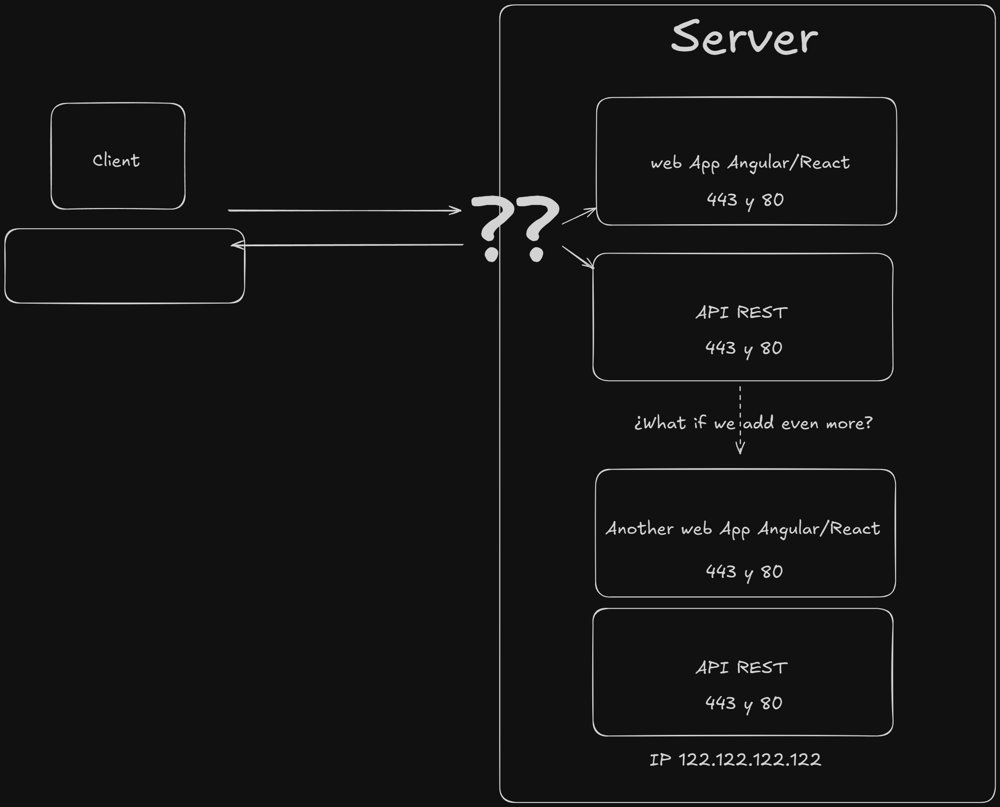

# INSTRUCCIONES PARA LA CONFIGURACIÓN DE UN SERVIDOR LINUX COMO SERVIDOR WEB NODE CON VARIOS SERVIDORES EXPRESS

## El problema

Queremos poder tener disponible un servidor web Express o similar corriendo a través de un proceso node.

El problema es que un servidor web sólo responde a los puertos 80 si es http o al puerto 443 si es https por defecto.

Si configuramos un servidor Express que, por ejemplo, corra una aplicación web hecha con Angular o React y luego queremos añadir otra aplicación web que tenga una API y que también funcione escuchando al puerto 443 y 80. Cuando le hagamos la petición al servidor... ¿Desde cuál de los servidores express-node contesta?

¿Y si añadimos aún más?

El problema será por tanto que nuestro servidor no va a saber desde que node contestar. Si le hemos añadido un dominio `www.midominioweb.com` y aunque añadamos un segundo dominio `www.midominioapi.com`, va a dar igual, ya que los dominios sólo indican a que IP dirigir las peticiones, y no a que puerto. Por lo cual no podemos esperar que cada uno de los dominios sea contestado por diferentes servidores Express.

## Las soluciones

- Una solución sería ir contratando un servidor por aplicación web. Pero va a ser una solución algo costosa e ineficiente.

- Otra solución podría ser especificar diferentes puertos y que los servidores web no estén escuchado al mismo puerto, y esta solución es quizás más factible para una API dejando la web React/Angular en el 443 para que se pueda llamar desde `https://www.midominioweb.com` (Cuando no se especifica puerto va al 443 si tiene https y al 80 si tiene http) mientras que las peticiones a la API podrían estar dirigidas específicamente a otros puertos: `https://www.midominioweb.com:3030`. Esta solución nos es válida en principio pero si añadimos más webs que sirvan frontends no podemos esperar que los usuaios de esas webs usen dominios que especifique puertos. Es una solución que da poca seriedad. Además esta solución nos va a traer otros problemas a la hora de expedir y renovar certificados SSL para poder usar https://

- La solución que aquí vamos a proponer es usar un tipo de servidor web que sea el único que escucha a esos puertos 443 y 80 y que reenvíe esas peticiones a otros servidores web corriendo de forma local en el servidor en otros puertos diferentes (p.e. 3010, 3011...) que no van a estar expuestos directamente. A este tipo de Servidor web se le conoce como un **Reverse Proxy**. Si además la combinamos con el uso de subdominios conseguimos con un único domínio hacer disponibles muchísimos servicios web: `https://www.midominioweb.com`, `https://api.midominioweb.com`, `https://mywebapp2.midominioweb.com` ya que el reverse proxy analizará de que dominio viene cada petición y lo repartirá al servidor local web adecuado. Además es una solución común que va a funcionar correctamente con clientes de gestión de certificados ssl como _certbot_ y que nos van a permitir dejar automatizado el proceso de renovación de esos certificados.

## El proceso de configuración

El proceso para configurar un servidor web desde cero va más allá de la configuración de un reverse proxy y múltiples servidores node corriendo de forma local. Pero tampoco mucho más allá. Vamos a cubrir el proceso completo ya que todos nos encontramos con el proceso completo y se agradece tener los pasos en una única guía.

Este proceso pretende configurar un servidor que sea seguro y funcional para producción, por lo que te va a parecer que algunos pasos sean innecesarios, pero si se hacen es para mejorar la seguridad.

Es posible que te preguntes qué servidor web tener. Mi recomendación es Ubuntu Server o Rocky Linux en su última versión LTS y SIN entorno de escritorio para no gastar recursos innecesariamente ya que las operaciones las vamos a realizar por la terminal.

Antes de adquirir o contrar el servidor, ya sea un VPS o una instancia cloud de un servidor es MUY recomendable que estés preparado para seguir al menos los primeros pasos previos a la instalación de servicios web ya que una vez se levante el servidor puedes estar seguro que algún bot automático va a encontrar tu web y va a intentar loguearse por fuerza bruta usando usuarios por defecto (como root) y contraseñas comunes.

Es por esos que nuestros primeros pasos van encaminados a esto.

1. Encontrar y analizar los datos de acceso que nos han dado para acceder a nuestro servidor web.
2. Modificar los datos de acceso y la posibilidad de acceso desde cuentas conocidas (p.e. como 'root', 'admin', 'administrator'...)
3. Comprobar y Levantar el firewall con las excepciones necesarias para que podamos seguir conectándonos al servidor.
4. Actualizar --Hasta aquí las operaciones a realizar de forma urgente nada más levantar el servidor--
5. Instalar Node
6. Instalar NGINX (Nuestro Reverse Proxy)
7. Instalar MySQL o MongoDB o el servidor DB que vayamos a usar (Si los necesitamos)
8. Crear un usuario SIN PERMISOS SUDO que será el propietario de las carpetas donde estén contenidos nuestros servidores node.
9. Crear scripts BASH con los comandos para levantar los servidores node.
10. Crear servicios que ejecuten dichos scripts para que nuestros servidores node funcionen como servicios del servidor.
11. Configurar nuestros dominios y subdominios para que dirigan a nuestro servidor.
12. Configurar nuestro reverse proxy para que dirija las peticiones de cada dominio o subdominio a sus servidores locales node correspondientes.
13. Configurar certbot para que expida y además se quede encargado de renovar los certificados SSL cuando corresponda.
14. Comprobar todo (Servicios enabled, Reinicio del servidor con todo levantado automáticamente) y salir a pisar hierba.
