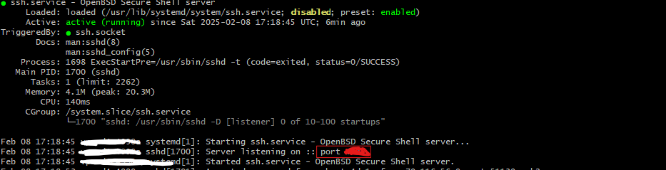

# INSTRUCTIONS FOR SETTING UP A LINUX SERVER AS A NODE WEB SERVER WITH MULTIPLE EXPRESS SERVERS

## The Problem

When we need to run multiple Node.js/Express web applications on the same server, we face a significant limitation: standard web ports.

By convention, web browsers connect to port 80 for HTTP and port 443 for HTTPS. If we try to run several Express applications simultaneously (for example, an Angular/React application and an API), they would all need to listen on these same ports.

<br/>


This creates a conflict: Which application should respond to incoming requests?

Even if we configure different domains (for example, `www.mywebdomain.com` for the frontend application and `www.myapidomain.com` for the API), the problem persists. Domains only determine which IP address the requests are directed to, but they don't specify the port. Therefore, we cannot assign different domains to different Express applications listening on the same port.

## The Solutions

- The first solution would be to hire an independent server for each web application. However, this is costly and inefficient from both a resource and management perspective.

- The second solution involves configuring applications to listen on different ports. For example, keeping the main React/Angular application on port 443 (accessible via `https://www.mywebdomain.com`), while the API would listen on another port (accessible via `https://www.mywebdomain.com:3030`). When no port is specified in the URL, the browser defaults to port 443 for HTTPS and 80 for HTTP.

  Although this solution might work initially, it presents two significant problems:

  1. It's not professional to require end users to include specific port numbers in URLs
  2. It significantly complicates the management and renewal of SSL certificates required for HTTPS

- The recommended solution is to use a web server that acts as a **Reverse Proxy**. This server will be the only one listening on ports 443 and 80, and will be responsible for forwarding requests to different web servers running locally on other ports (for example, 3010, 3011...). These local servers remain secure by not being directly exposed to the Internet, as their ports are not open in the firewall.

  By combining this configuration with subdomains, we can offer multiple web services through a single main domain:

  - `https://www.mywebdomain.com` (main frontend)
  - `https://api.mywebdomain.com` (API)
  - `https://mywebapp2.mywebdomain.com` (another application)

  The reverse proxy analyzes the domain of each incoming request and redirects it to the corresponding local server.

  This architecture is a proven solution that works perfectly with SSL certificate managers like _certbot_, allowing complete automation of the certificate issuance and renewal process.

  <br/>


<br/>

## Configuration Process

The process of setting up a web server from scratch goes beyond configuring a reverse proxy and multiple node servers running locally. But not much beyond that. We'll cover the complete process since we all find ourselves having to perform the complete process and it's helpful to have the steps in a single guide.

This process aims to configure a server to be secure and functional for production, so some steps might seem unnecessary, but they are done to improve security.

You might wonder what operating system to have on the server. My recommendation is Ubuntu Server or Rocky Linux (due to their widespread use) in their latest LTS version and WITHOUT desktop environment to avoid wasting resources unnecessarily since we'll perform operations through the terminal.

Before acquiring or contracting the server, whether it's a VPS or a cloud server instance, it's HIGHLY recommended that you're prepared to follow at least the first steps prior to installing web services since once the server is up you can be sure that some automated bot will find your web and will try to login by brute force using default users (like root) and common passwords.

That's why our first steps are aimed at this.

1. Find and analyze the access data we've been given to access our web server.
2. Modify the access data and the possibility of access from known accounts (e.g., like 'root', 'admin', 'administrator'...)
3. Check and Set up the firewall with the necessary exceptions so we can continue connecting to the server.
4. Update --Up to here are the operations to perform urgently as soon as the server is up--
5. Install Node
6. Install NGINX (Our Reverse Proxy)
7. Install MySQL or MongoDB or whatever DB server we're going to use (If we need them)
8. Create a user WITHOUT SUDO PERMISSIONS that will be the owner of the folders where our node servers are contained.
9. Create BASH scripts with commands to start the node servers.
10. Create services that execute these scripts so our node servers function as server services.
11. Configure our domains and subdomains to point to our server.
12. Configure our reverse proxy to direct requests from each domain or subdomain to their corresponding local node servers.
13. Configure certbot to issue and also be in charge of renewing SSL certificates when appropriate.
14. Check everything (Services enabled, Server restart with everything automatically up) and go touch grass.

## 1. FINDING AND ANALYZING THE ACCESS CREDENTIALS PROVIDED FOR OUR WEB SERVER

Once we have completed the contracting process, our server will be available for access within a few minutes. The access credentials can be sent to us via email or obtained through our provider's control panel.

We must analyze the username we've been given. If it's `root`, for example, we have a problem because `root` is a superuser that exists on all Linux machines, but for security reasons is often not given remote access. However, if we've been given access credentials with `root`, it means this user DOES have remote access, and this is problematic because automated bots that try to access servers through brute force are constantly trying combinations with `root` and passwords, some simple like `1234` or `password`, others a bit more complicated, but constantly.

To access through brute force, they need to find your username and password. If they somehow know your username, they already have half the work done. They might, for example, know the IP range of your provider and that access is given with the root user, or other circumstances that let them know your username. That's why it's vitally important that if your provider has given you a too common username, like `root`, `admin` or the provider's name, such as `arsys` or `hostinger` (I'm not saying these providers use these usernames, they're just examples), it's crucial that you either create a new user and remove remote access from the other user.

Then we need to analyze the password, although this should always be changed. In reality, both username and password should be changed. The difference or need for analysis is the urgency with which you must perform these actions. With usernames like `root` or `admin` or `administrator`, the change is extremely urgent. With a common username like the server provider's name, the change is urgent. With a username that looks random like `a12hjdMa`, the change wouldn't be as urgent, but still recommended.

Our provider might allow us to choose the access format, as we can not only access through username and password. We can also access through username and shared key, which we should install on the computer. As this case is less frequent, we'll leave it aside, although it's a more secure method but with the inconvenience of having to install the key on all computers from which access can be made.

Another case we might encounter is that we've been given a specific port for remote connection different from the default port. In that case, congratulations, your server is much more secure just because of this, although now the port is another parameter to remember along with the username and password. But first, let's explain a bit about how we connect remotely for those not familiar with SSH.

### Remote connection through SSH service

To connect remotely to our server, the provider will have set up the server with SSH service enabled. SSH stands for _Secure Shell_ and allows us to connect from any terminal, like `Git Bash`, `CMD`, `PowerShell` or `Terminal Mac`, although we can also use a program like `PuTTy` to make the connection and have the terminal. In any case, to connect via SSH you need to open a terminal program like those mentioned above.

This service has a default connection port: **Port 22**. If our provider doesn't say anything in the access credentials, it means we use that port.
In that case, we could connect to our server using any of the following fictional usernames and addresses:

```Bash
ssh <your username>@<your server address>
```

for example

```Bash
ssh root@122.122.122.122
```

or using a domain name:

```Bash
ssh root@sajkjsd-122.cloud.hostinger.com
```

If the address is correct, it will immediately ask for the password. BE CAREFUL as when typing the password NO CHARACTERS WILL BE SHOWN, NOT EVEN HIDDEN ONES to improve security in case someone could see your screen so they wouldn't even have the data of your password length. This makes it easier to make mistakes, so be careful when entering the password, as you won't be able to see anything to know if you've entered one character too many or too few.

**If our provider has given us a specific port different from 22 for SSH**

Then the connection would be like this, for example, to port 2244:

```Bash
ssh -p 2244 root@122.122.122.122
```

## 2. MODIFY ACCESS CREDENTIALS

To improve our server's security, we'll follow these steps:

#### 2.1 Create a new user with administrator privileges (Sudo)

First, we'll create a new user with _sudo_ privileges. To create a _sudo_ user, our current user must also have _sudo_ privileges. Therefore, we must add the word `sudo` before the command to execute. It may request a `sudo` password when performing the action. It's the same password as the user you used for access. As an exception, the `root` user doesn't need to add the sudo command.

```bash
# Create new user
sudo adduser yournewuser

# Add to sudo group
sudo usermod -aG sudo yournewuser
```

At this point, it's recommended to test if you have SSH access with this new user. Either close the current terminal and open a new one, or use the `exit` command and then use the command again.

#### 2.2 Configure SSH for better security

We'll edit the SSH configuration file using the Nano editor:

```bash
sudo nano /etc/ssh/sshd_config
```

We'll make the following changes in this text file. Find the line that's already written with the parameter name to configure and modify it. DO NOT ADD A NEW LINE WITH THE INSTRUCTION. You must modify the existing line.

```text:/etc/ssh/sshd_config
# Disable root access
PermitRootLogin no

# Disable password authentication (optional, only if using SSH keys - IF NOT IT'S IMPORTANT TO LEAVE IT AS yes)
PasswordAuthentication yes

# Change SSH port (optional but recommended - VERY IMPORTANT - The number is just an example.
# You must find your own port. Just make sure it's available -
# check the list in the link)
Port 2244
```

When changing the SSH port, remember 2 things: Write down the port correctly. Don't use a port that's being used by another service.

[Here's a list of the most common ports to avoid using them if you decide to change the SSH port](https://www.stationx.net/common-ports-cheat-sheet/)

#### 2.3 Restart SSH service

```bash
sudo systemctl restart sshd
```

#### 2.4 Verify access with the new user

Before closing the current session, open a new terminal and verify that you can access with the new user:

```bash
ssh -p 2244 yournewuser@your-server-ip
```

⚠️ **IMPORTANT**:

- Don't close the original session until confirming you can access with the new user
- Save the new SSH port if you changed it
- If you use a firewall, make sure to allow the new SSH port:

```bash
sudo ufw allow 2244/tcp
```

#### 2.5 Disable unnecessary users (optional, but, again, recommended)

If you want to disable users like 'admin' or 'administrator' to improve security and prevent them from connecting via SSH:

```bash
sudo passwd -l username
```

This will lock the account without deleting it.

## 3. CHECK AND SET UP THE FIREWALL

The firewall is an essential part of our server's security. In Ubuntu Server, we'll use UFW (Uncomplicated Firewall), which comes pre-installed but is generally disabled.

### 3.1 Verify firewall status

```bash
sudo ufw status
```

If it appears as "inactive", we'll need to configure it.

### 3.2 Basic firewall configuration

Before activating the firewall, we must ensure we allow SSH connections to avoid being locked out of the server:

```bash
# If using default SSH port (22)
sudo ufw allow 22/tcp

# If we've changed the SSH port (example: 2244)
sudo ufw allow 2244/tcp
```

### 3.3 Enable the firewall

```bash
sudo ufw enable
```

⚠️ **IMPORTANT**: Make sure you've allowed SSH access before enabling the firewall.

### 3.4 Recommended basic rules

```bash
# Deny all incoming traffic by default
sudo ufw default deny incoming

# Allow all outgoing traffic by default
sudo ufw default allow outgoing

# Allow HTTP
sudo ufw allow 80/tcp

# Allow HTTPS
sudo ufw allow 443/tcp
```

### 3.5 Verify configured rules

```bash
sudo ufw status verbose
```

### 3.6 Additional useful commands

**(NOT TO USE NOW, for reference)**

```bash
# Delete a rule
sudo ufw delete allow 80/tcp

# Reload rules
sudo ufw reload

# Disable firewall (not recommended in production)
sudo ufw disable
```

### 3.7 Check if your provider uses another firewall configurable from the control panel

Your provider might use an additional firewall layer. It's good practice to use both firewalls since if the external firewall fails, you won't get any notification and your website would be unprotected.

If your provider uses such external firewall, you'll need to allow both internal and external traffic for the new SSH port and any other service you add. If it's a web server, verify that ports 80 and 443 are open for input and output.

### 3.8 🛟 If you've locked yourself out of the server 🛟

You might have accidentally locked yourself out of the server. Don't despair, it has happened to all of us, and not all is lost.

In this case, you'll need to go back to your provider's control panel and check if they have another type of access called "Panel Access" or "Remote". This would allow us to access through remote desktop as if we were physically in front of the server's monitor, so firewall or SSH configurations wouldn't matter. However, you must know your user and password. From here, we could access and modify the SSH or firewall configurations that have blocked server access.

If there's no such access... then, you'll have to use the control panel option that allows you to reinstall the server and start the process again.

If none of these options are available, contact your provider to have them reset the server with default configurations.

### 3.9 ⚠️ **IMPORTANT NOTES**:

- Always double-check that you've allowed SSH access before enabling the firewall

- If you need to access other services (like databases), remember to open the corresponding ports.

  However, **my recommendation is NOT to open such ports in the case of Databases as long as your API is hosted on the same server** since your database will make a local connection and doesn't need to be exposed to the internet, which is always a risk if unnecessary.

- It's recommended to keep the number of open ports to the minimum necessary

- Consider using allowed IP ranges for critical services if possible

## 4. UPDATE THE SYSTEM

We'll apply pending updates in case there are any security patches available. To do this, we'll run `update` for `apt` (aptitude), which is Ubuntu's package manager, and then `upgrade` to apply the updates. Rocky Linux's package manager is `dfn`, although here I'll only present the installation with `apt`, it shouldn't be much different if using `dfn`.

```bash
sudo apt update && upgrade -y
```

It's possible and recommended that we need to restart the system

```bash
sudo reboot
```

## 5. INSTALL NODE

To install Node.js on our server, we have several options. The recommended one is to use NVM (Node Version Manager) which will allow us to install and manage multiple versions of Node.js. This in turn will allow us to run servers with different Node versions within the same server.

### 5.1 Install NVM

First, we download and execute the NVM installation bash script with the latest version, but it's recommended to check the [nvm repository](https://github.com/nvm-sh/nvm/) to find out what the current latest version of nvm is.

```bash
curl -o- https://raw.githubusercontent.com/nvm-sh/nvm/v0.40.1/install.sh | bash
```

After installing, we restart the terminal or execute the following to refresh and have the `nvm` command available:

```bash
source ~/.bashrc
```

### 5.2 Verify NVM installation

```bash
nvm --version
```

### 5.3 Install Node.js

To install the latest LTS version of node (recommended for production):

```bash
nvm install --lts
```

Or if you need a specific version:

```bash
nvm install 20.11.1  # For example, to install version 20.11.1
```

Or if you want to install the latest version 22 (Recommended option when you need several Node versions):

```bash
nvm install 22  # For example, to install version 22.##.#
```

Node uses even numbers for LTS versions. Currently, the LTS versions are 22, 20 is still in maintenance, and 18 is in the process of being deprecated and maintenance ending. It's recommended to use these Node versions because they continue receiving security updates.

### 5.4 Verify the installation

```bash
node --version
npm --version
```

### 5.5 Useful NVM commands

```bash
nvm ls                 # List installed versions
nvm use 16.20.0        # Switch to a specific version
nvm use 20             # Switch to the latest installed LTS version that starts with 20
nvm current            # See current version in use
```

## 6. INSTALL NGINX

NGINX will be our reverse proxy server that will manage all incoming requests and redirect them to our local Node.js servers.

### 6.1 NGINX Installation

```bash
# Update repository to have the latest version
sudo apt update

# Install NGINX
sudo apt install nginx -y
```

This will run the installer with default options, which are necessary for our use. NGINX will be installed as a service on our server. To interact with this service and all services installed on the server, we'll use the `systemctl` tool.

### 6.2 Verify the installation

```bash
# Check service status
sudo systemctl status nginx
```

You should see text with a green dot indicating if the service is running, if it's `enabled` (meaning it will start automatically with each system restart) and the latest console outputs from the application.

### 6.3 Basic management commands

```bash
# Start NGINX
sudo systemctl start nginx

# Stop NGINX
sudo systemctl stop nginx

# Restart NGINX
sudo systemctl restart nginx

# Reload configuration without stopping the service (Useful when we've made configuration changes and want them to take effect without restarting the service)
sudo systemctl reload nginx

# Enable NGINX to start with the system
sudo systemctl enable nginx
```

### 6.4 Verify the firewall

Make sure NGINX can receive traffic by allowing HTTP and HTTPS ports (In theory we should have already done this step, but it doesn't hurt to make sure by allowing application access through the firewall):

```bash
sudo ufw allow 'Nginx Full'
```

### 6.5 Verify installation and operation

Open a browser and visit your server's IP. You should see NGINX's default welcome page. At this point, you would have the NGINX web server running.

## 7. INSTALL THE DATABASE SERVER

The choice of database server will depend on the specific needs of your project. Here we'll cover the installation of both MySQL and MongoDB, which are the most common options.

### 7.1 MySQL Installation

```bash
# Update repositories
sudo apt update

# Install MySQL Server
sudo apt install mysql-server -y

# Start MySQL service
sudo systemctl start mysql

# Enable MySQL to start with the system
sudo systemctl enable mysql

# Run MySQL security script
sudo mysql_secure_installation
```

During the execution of `mysql_secure_installation`, you'll be asked several questions:

- Configure password validation (recommended: Y)
- Password validation level (recommended: 2)
- Change root password
- Remove anonymous users (recommended: Y)
- Disable root remote access (recommended: Y)
- Remove test database (recommended: Y)
- Reload privileges (recommended: Y)

### 7.2 MongoDB Installation

[Official installation instructions](https://www.mongodb.com/docs/manual/tutorial/install-mongodb-on-ubuntu/)

```bash
# Import MongoDB public key
curl -fsSL https://www.mongodb.org/static/pgp/server-8.0.asc | \
   sudo gpg -o /usr/share/keyrings/mongodb-server-8.0.gpg \
   --dearmor

# Create repository list file for Ubuntu 24 for MongoDB (Check guide for other versions)
echo "deb [ arch=amd64,arm64 signed-by=/usr/share/keyrings/mongodb-server-8.0.gpg ] https://repo.mongodb.org/apt/ubuntu noble/mongodb-org/8.0 multiverse" | sudo tee /etc/apt/sources.list.d/mongodb-org-8.0.list

# Update repository
sudo apt update

# Install MongoDB
sudo apt install -y mongodb-org

# Start MongoDB service
sudo systemctl start mongod

# Enable MongoDB to start with the system
sudo systemctl enable mongod
```

### 7.3 Verify Installation

For MySQL:

```bash
# Check service status
sudo systemctl status mysql

# Check version
mysql --version
```

For MongoDB:

```bash
# Check service status
sudo systemctl status mongod

# Check version
mongod --version
```

### 7.4 Important Security Considerations

#### 7.4.1 **Remote Access**:

By default, both MySQL and MongoDB only listen to local connections (127.0.0.1). It's recommended to maintain this configuration if your API is on the same server.

#### 7.4.2 **Ports and Firewall**:

If you still want to enable external access, for security reasons, it's recommended to change the default database ports:

For MySQL (change port 3306):

```bash
# Edit MySQL configuration
sudo nano /etc/mysql/mysql.conf.d/mysqld.cnf

# Find or add the line:
port = 3307  # Or your preferred port

# Restart MySQL
sudo systemctl restart mysql
```

For MongoDB (change port 27017):

```bash
# Edit MongoDB configuration
sudo nano /etc/mongod.conf

# Find the net: section and modify the port:
net:
  port: 27018  # Or your preferred port

# Find the bindIp section and modify the listening IP:

bindIp: \* # Will listen to all IPs
bindIp: 127.0.0.1 # Will only listen locally to the server itself

# Restart MongoDB
sudo systemctl restart mongod
```

Then you'll need to open the new ports in your firewall:

```bash
# For MySQL (example with port 3307)
sudo ufw allow 3307/tcp

# For MongoDB (example with port 27018)
sudo ufw allow 27018/tcp
```

---

⚠️ **IMPORTANT**:

- Document the new ports in a secure location
- Update the connection configuration in your applications
- Consider using a non-standard port to make automatic scanning more difficult
- Still, it's preferable to maintain access only at the local level

---

#### 7.4.3 **Users and Permissions**: Create specific users for your applications with minimal necessary privileges:

For MySQL:

```bash
sudo mysql
```

```sql
CREATE USER 'youruser'@'localhost' IDENTIFIED BY 'yourpassword';
GRANT ALL PRIVILEGES ON yourdatabase.* TO 'youruser'@'localhost';
FLUSH PRIVILEGES;
```

For MongoDB:

```bash
mongosh
```

```javascript
use admin
db.createUser({
  user: "youruser",
  pwd: "yourpassword",
  roles: [{ role: "readWrite", db: "yourdatabase" }]
})
```

⚠️ **IMPORTANT**:

- Use strong and unique passwords
- Avoid using root/admin user for applications
- Keep databases updated with the latest security patches
- Perform regular backups
- If possible, maintain connections only at the local level (localhost / 127.0.0.1)

#### 7.4.4 **MySQL: Perform necessary operations to create the structure (and data if you already have it) of your application databases**:

If you already have a database created on your computer, now is the time to export its structure and data via SQL query and transfer it to the server using SFTP (Same access as SSH, including port if you modified it) to be able to execute it on the server to create the database and the data you exported.

The user would be the database user you created in the previous point for this database. Don't confuse it with the system user we're going to create in the next point.

```bash
# First create the database if it doesn't exist
mysql -u yourdatabaseuser -p -e "CREATE DATABASE IF NOT EXISTS database_name;"

# Then import the file
mysql -u yourdatabaseuser -p database_name < backup.sql
```

## 8. CREATE UNPRIVILEGED USER FOR NODE SERVERS AND FOLDER STRUCTURE

For security reasons, it's good practice to run our Node.js servers under a user without administrator privileges. This limits potential damage in case one of our applications is compromised.

### 8.1 Create new user (modify nodeuser with your preferred name)

```bash
# Create user without home directory
sudo useradd --no-create-home nodeuser

# Or if you prefer to create home directory (optional)
sudo useradd --create-home nodeuser

# Set a password (although we won't need it to run services)
sudo passwd nodeuser
```

### 8.2 Create and configure directory for applications

```bash
# Create directory for applications
sudo mkdir -p /var/www/nodeapps

# Set nodeuser as owner
sudo chown -R nodeuser:nodeuser /var/www/nodeapps

# Set appropriate permissions
sudo chmod -R 755 /var/www/nodeapps
```

### 8.3 Verify configuration

```bash
# Verify owner and permissions
ls -la /var/www/nodeapps

# Test access as nodeuser
sudo -u nodeuser ls -la /var/www/nodeapps
```

### 8.4 Important considerations

- The `nodeuser` won't be able to execute commands with `sudo`
- It can only access and modify files within `/var/www/nodeapps`
- When transferring files via SFTP to `/var/www/nodeapps`, it's recommended to use `nodeuser` so that user is the owner of those transferred files
- Node.js services will run under this user
- For operations requiring more privileges, you'll need to use your user with sudo privileges

### 8.5 Recommended directory structure (modify myapp# with the name that identifies your project)

We'll create, besides our directories that will contain the web projects, a directory where we'll store the web service startup scripts for each project.

```bash
/var/www/nodeapps/
├── myapp1/
│   ├── src/
│   └── node_modules/
├── myapp2/
│   ├── src/
│   └── node_modules/
└── start_scripts
```

To create this structure:

```bash
# Create directories for applications
sudo -u nodeuser mkdir -p /var/www/nodeapps/myapp1
sudo -u nodeuser mkdir -p /var/www/nodeapps/myapp2
sudo -u nodeuser mkdir -p /var/www/nodeapps/start_scripts

# Verify structure
tree /var/www/nodeapps
```

Now you would need to transfer the projects to each folder using sftp and using `nodeuser` as the user to perform the connection and transfer so that it becomes the owner of those files.

## 9. CREATE BASH SCRIPTS TO START NODE SERVERS

Bash scripts will help us manage the startup of our Node.js applications in a consistent and organized way. We'll create a script for each application we need to run.

### 9.1 Create startup scripts

For each application, we'll create a bash script in the `/var/www/nodeapps/start_scripts` directory that will allow us to specify which node version we want to use with our application.

```bash
# Create script for the first application
sudo nano /var/www/nodeapps/start_scripts/start_myapp1.sh
```

Script content (adjust according to your application - the first line tells the system it's a bash script):

```bash:start_myapp1.sh
#!/bin/bash

# Define the nvm command within the script
export NVM_DIR="$HOME/.nvm"
[ -s "$NVM_DIR/nvm.sh" ] && \. "$NVM_DIR/nvm.sh"

# Set Node.js version
nvm use 20  # Or the version you need

# Start the application with the node or npm command you need
node /var/www/nodeapps/myapp1/src/index.js
```

Alternatively, if you want to save and manage logs, you can output the console and errors to a file by modifying the last line to:

```bash
# Start the application
node /var/www/nodeapps/myapp1/src/index.js >> /var/www/nodeapps/myapp1.log 2>&1
```

But in this case remember that you need to manage these files somehow as they will grow without limit.

In any case, if you don't set a log output you can still check error logs in `journalctl`, but these are usually limited in size and days. So they will be automatically deleted after several days and won't take up unlimited space.

You can check the current `journalctl` configuration like this:

```bash
# View current systemd-journald configuration
sudo systemctl show systemd-journald
```

### 9.2 Configure permissions

```bash
# Give execution permissions to the script
sudo chmod +x /var/www/nodeapps/start_scripts/start_myapp1.sh

# Assign ownership to nodeuser
sudo chown nodeuser:nodeuser /var/www/nodeapps/start_scripts/start_myapp1.sh
```

### 9.3 Test the script to see if it starts the server

```bash
# Run the script as nodeuser
sudo -u nodeuser /var/www/nodeapps/start_scripts/start_myapp1.sh
```

## 10. CREATE SYSTEMD SERVICES FOR NODE SERVERS

To ensure our Node.js applications run automatically when the server starts and restart in case of failure, we'll create systemd services for each of them.

### 10.1 Create the service file

For each application, we'll create a service file in `/etc/systemd/system/`:

```bash
sudo nano /etc/systemd/system/myapp1.service
```

Service file content:

```ini:/etc/systemd/system/myapp1.service
[Unit]
Description=MyApp1 Web Server
After=network.target

[Service]
User=nodeuser
ExecStart=/var/www/nodeapps/start_scripts/start_myapp1.sh
Restart=always

[Install]
WantedBy=multi-user.target
```

### 10.2 Service options explanation

- `Description`: Service description
- `After`: Indicates that the service should start after the network is available
- `User`: User under which the service will run
- `ExecStart`: Path to the script that starts the application
- `Restart`: Restart policy (always = restart whenever the service stops)
- `WantedBy`: When the service starts (When system reaches multi-user state - users can log into the system - Required for automatic startup)

### 10.3 Enable and manage the service

```bash
# Reload systemd configuration to load the created file
sudo systemctl daemon-reload

# Start the service
sudo systemctl start myapp1.service

# Enable the service to start with the system
sudo systemctl enable myapp1.service
```

Other useful commands to manage the service:

```bash
# Stop the service
sudo systemctl stop myapp1.service

# Check service status
sudo systemctl status myapp1.service
```

### 10.4 Useful commands to manage the service

```bash
# Stop the service
sudo systemctl stop myapp1.service

# Restart the service
sudo systemctl restart myapp1.service

# View service logs -scroll down to see the most recent-
sudo journalctl -u myapp1.service
```

## 11. CONFIGURING DOMAINS AND SUBDOMAINS

For our domains and subdomains to point to our server, we need to configure the corresponding DNS records. This process is done through your domain provider's control panel.

There you'll find a DNS/Nameservers section where you can edit the current records of a specific domain and add the necessary ones. You may already have an A record with name @ that you'll need to edit and then add an A record with name `api` or the subdomain.

Remember to check existing records before adding to avoid duplicate records. If you migrate the hosting server in the future, remember to come back here to modify the records pointing to the new IP.

### 11.1 Required DNS Record Types

#### A Record (Recommended for faster response)

- Points a domain or subdomain directly to an IP address
- It's the most common record type and works for both main domain and subdomains
- Resolves faster than CNAME

```text
Type: A
Name: @
IP: 123.123.123.123
TTL: 3600

# Subdomain using A record
Type: A
Name: api
IP: 123.123.123.123
TTL: 3600
```

#### CNAME Record (As an alternative to using an A record for a subdomain - DON'T USE BOTH FOR A SUBDOMAIN, use one or the other)

- Points a subdomain to another domain
- Useful for creating multiple subdomains
- If you change the main one, the CNAME doesn't need modification, as CNAME adjusts to a main A record.

```text
Type: CNAME
Name: api         // Will create api.yourdomain.com
Target: @         // Points to the main domain
```

### 11.2 Typical Configuration for a Website with Main Domain and API as Subdomain using CNAME

For example, to configure `mydomain.com` and `api.mydomain.com`:

```text
# Main domain
Type: A
Name: @
IP: 123.123.123.123
TTL: 300

# www subdomain
Type: CNAME
Name: www
Target: @
TTL: 300

# API subdomain
Type: CNAME
Name: api
Target: @
TTL: 300
```

### 11.3 Important Considerations

- DNS changes can take up to 48 hours to propagate globally (TTL - Time To Live) but usually take just a few minutes.
- It's recommended to start with a low TTL (100-300 seconds) during initial setup in case you need to make a change so propagation takes less time.
- Once stable, you can increase the TTL (3600 seconds is a common setting)

## 12. CONFIGURING NGINX AS A REVERSE PROXY

At this point, we should have our node services running locally and our NGINX web server returning the default web page.

To check if the node servers are running correctly, we can temporarily open their port in the firewall and check with the browser if it's working by going to the domain and directly to the node port.

```bash
# To access the node running on 3010
sudo ufw allow 3010/tcp
```

Then with the browser we open the address and port with http `http://mydomain.com:3010`

Once checked, we should close the port again

```bash
sudo ufw delete allow 3010/tcp
```

Now we're going to make NGINX act as a reverse proxy, and have it redirect incoming requests to different Node.js servers based on the requested domain or subdomain.

### 12.1 Simple NGINX Configuration Structure

We can follow two structures: we can modify the current configuration file directly or add individual configuration files.

The first method is valid for a server with few node services, the second is recommended to maintain everything better if the server grows.

With the first one, we'll edit the configuration file and add our servers

First, we'll make a backup of the configuration file

```bash
sudo cp /etc/nginx/sites-available/default /etc/nginx/sites-available/default-backup
```

Then we open the configuration file with nano

```bash
sudo nano /etc/nginx/sites-available/default
```

We'll go to the line that says `#Default server configuration` and we'll insert above it (leaving everything above and below this line intact as reference) our configuration of a server listening on port 80:

```text
server {
    listen 80;
    server_name www.mydomain.com mydomain.com;

    location / {
        proxy_pass http://localhost:3010;
        proxy_http_version 1.1;
        proxy_read_timeout 300;
        proxy_connect_timeout 300;
        proxy_set_header Upgrade $http_upgrade;
        proxy_set_header Connection 'upgrade';
        proxy_set_header Host $host;
        proxy_cache_bypass $http_upgrade;
    }
}
```

With this, we have configured requests coming from the browser address http://www.mydomain.com with and without www to be directed to the node running on 3010. Now we want HTTPS requests to be directed to the same. We add below the closing brace another block but for port 443.

```text
server {
    listen 443 http2;
    server_name www.mydomain.com mydomain.com;

    location / {
        proxy_pass http://localhost:3010;
        proxy_http_version 1.1;
        proxy_read_timeout 300;
        proxy_connect_timeout 300;
        proxy_set_header Upgrade $http_upgrade;
        proxy_set_header Connection 'upgrade';
        proxy_set_header Host $host;
        proxy_cache_bypass $http_upgrade;
    }
}
```

We've now added the configuration for the main domain and its www subdomain. Now let's add the configuration for the subdomain api.mydomain.com pointing to the node running on port 3020 in the same way, but being careful to ADD IT ABOVE the main one so that the forwarding executes before the main one.

```text
server {
    listen 80;
    server_name api.mydomain.com;

    location / {
        proxy_pass http://localhost:3020;
        proxy_http_version 1.1;
        proxy_read_timeout 300;
        proxy_connect_timeout 300;
        proxy_set_header Upgrade $http_upgrade;
        proxy_set_header Connection 'upgrade';
        proxy_set_header Host $host;
        proxy_cache_bypass $http_upgrade;
    }
}

server {
    listen 443 http2;
    server_name api.mydomain.com;

    location / {
        proxy_pass http://localhost:3020;
        proxy_http_version 1.1;
        proxy_read_timeout 300;
        proxy_connect_timeout 300;
        proxy_set_header Upgrade $http_upgrade;
        proxy_set_header Connection 'upgrade';
        proxy_set_header Host $host;
        proxy_cache_bypass $http_upgrade;
    }
}
```

Save the file and verify and reload the nginx configuration to load the changes.

```bash
# Verify that the syntax is correct
sudo nginx -t

# Reload NGINX to apply changes
sudo systemctl reload nginx
```

### 12.2 More Scalable NGINX Configuration Structure

NGINX configuration is organized in several directories:

```bash
/etc/nginx/
├── nginx.conf              # Main configuration
├── sites-available/        # Available site configurations
└── sites-enabled/         # Symbolic links to active configurations
```

For each application, we'll create a configuration file in sites-available leaving the `/etc/nginx/sites-available/default` file intact. In this case, we'll create a file in that same folder with the application name:

```bash
sudo nano /etc/nginx/sites-available/myapp1
```

And we write the basic configuration for a web application:

```nginx:/etc/nginx/sites-available/myapp1
server {
    listen 80;
    server_name mydomain.com www.mydomain.com;

    location / {
        proxy_pass http://localhost:3010;  # Port where your Node app listens
        proxy_http_version 1.1;
        proxy_set_header Upgrade $http_upgrade;
        proxy_set_header Connection 'upgrade';
        proxy_set_header Host $host;
        proxy_cache_bypass $http_upgrade;
    }
}

server {
    listen 443 http2;
    server_name mydomain.com www.mydomain.com;

    location / {
        proxy_pass http://localhost:3010;
        proxy_http_version 1.1;
        proxy_read_timeout 300;
        proxy_connect_timeout 300;
        proxy_set_header Upgrade $http_upgrade;
        proxy_set_header Connection 'upgrade';
        proxy_set_header Host $host;
        proxy_cache_bypass $http_upgrade;
    }
}
```

For an API on subdomain api.mydomain.com:

```bash
sudo nano /etc/nginx/sites-available/myapp1-api
```

```nginx:/etc/nginx/sites-available/myapp1-api
server {
    listen 80;
    server_name api.mydomain.com;

    location / {
        proxy_pass http://localhost:3020;  # Port where your API listens
        proxy_http_version 1.1;
        proxy_set_header Upgrade $http_upgrade;
        proxy_set_header Connection 'upgrade';
        proxy_set_header Host $host;
        proxy_cache_bypass $http_upgrade;
    }
}

server {
    listen 443 http2;
    server_name api.mydomain.com;

    location / {
        proxy_pass http://localhost:3020;
        proxy_http_version 1.1;
        proxy_read_timeout 300;
        proxy_connect_timeout 300;
        proxy_set_header Upgrade $http_upgrade;
        proxy_set_header Connection 'upgrade';
        proxy_set_header Host $host;
        proxy_cache_bypass $http_upgrade;
    }
}
```

#### Activate the Configurations

Create symbolic links in sites-enabled to activate these configurations:

```bash
sudo ln -s /etc/nginx/sites-available/myapp1 /etc/nginx/sites-enabled/
sudo ln -s /etc/nginx/sites-available/myapp1-api /etc/nginx/sites-enabled/
```

#### Verify and Reload the Configuration

```bash
# Verify that the syntax is correct
sudo nginx -t

# Reload NGINX to apply changes
sudo systemctl reload nginx
```

And thus, following this process of adding configuration files and enabling them by including their symbolic link in the `sites-enabled` folder, we can keep including subsequent node web servers to forward requests to.

### 12.3 Server Improvements

We can include configurations like adding compression or others to improve performance

```nginx:/etc/nginx/sites-available/myapp1
server {
    # ... basic configuration ...

    # Enable gzip compression (Recommended)
    gzip on;
    gzip_types text/plain text/css application/json application/javascript text/xml application/xml application/xml+rss text/javascript;
    gzip_min_length 1000;

    # Cache for static files (Only if website content doesn't change often)
    location /static/ {
        expires 1y;
        add_header Cache-Control "public, no-transform";
    }
}
```

## 13. CONFIGURING CERTBOT FOR SSL CERTIFICATE MANAGEMENT

Certbot is a tool that automates the process of obtaining and renewing free SSL certificates from Let's Encrypt.

### 13.1 Install Certbot and the NGINX plugin

```bash
# Update repositories
sudo apt update

# Install Certbot and its NGINX plugin
sudo apt install certbot python3-certbot-nginx -y
```

### 13.2 Obtain SSL certificates

There are two ways to obtain certificates:

#### Option 1: Automatic Obtaining (Recommended)

This option will automatically modify the NGINX configuration. This means it will write to the configuration files where you have included the listener for that domain and port 443, adding the SSL option and the path where the certificates have been placed.

To perform the installation with automatic renewal for the three domains, use this command:

```bash
sudo certbot --nginx -d mydomain.com -d www.mydomain.com -d api.mydomain.com
```

#### Option 2: Manual Obtaining (Not Recommended)

If you prefer to manually manage the NGINX configuration, you won't have automatic renewal and will need to repeat the process every 3 months:

```bash
sudo certbot certonly --nginx -d mydomain.com -d www.mydomain.com -d api.mydomain.com
```

During the process (Both automatic and manual):

- You'll be asked for an email address for important notifications
- You'll need to accept the terms of service
- Choose whether to share your email with the EFF
- Certbot will verify domain ownership
- Certificates will be generated and configured

### 13.3 Verify automatic renewal

Certbot automatically creates a scheduled task to renew certificates before they expire. You can verify it:

```bash
# View renewal timer
sudo systemctl list-timers | grep certbot

# Test renewal process (dry run, no actual changes)
sudo certbot renew --dry-run
```

### 13.4 Certificate Location

Certificates are stored in:

```text
/etc/letsencrypt/live/yourdomain.com/
├── cert.pem       # Domain certificate
├── chain.pem      # Intermediate certificates
├── fullchain.pem  # cert.pem + chain.pem
└── privkey.pem    # Private key
```

### 13.5 Useful Certbot Commands

```bash
# List installed certificates
sudo certbot certificates

# Delete a specific certificate
sudo certbot delete --cert-name mydomain.com

# Revoke and delete a certificate
sudo certbot revoke --cert-path /etc/letsencrypt/live/mydomain.com/cert.pem

# Force manual renewal (usually not necessary)
sudo certbot renew --force-renewal
```

### 13.6 Important Considerations

- Let's Encrypt certificates are free but perfectly valid
- Let's Encrypt certificates expire every 90 days
- Automatic renewal is attempted twice daily when 30 days remain until expiration
- Automatic renewal will restart/reload NGINX automatically to pick up the data; if done manually, restarting/reloading is your responsibility
- Keep the contact email updated to receive important notifications
- If you change NGINX configuration, verify that certificates still work
- Let's Encrypt has rate limits: maximum 50 certificates per domain per week

## 14. FINAL SERVER VERIFICATION

Before finalizing the server configuration, it's important to perform a series of checks to ensure everything works correctly and will start automatically after a reboot.

### 14.1 Verify Service Status

```bash
# Check that all necessary services are active and enabled
sudo systemctl status nginx
sudo systemctl status myapp1.service
sudo systemctl status myapp2.service  # If you have more applications
sudo systemctl status mysql  # If using MySQL
sudo systemctl status mongod  # If using MongoDB
```

### 14.2 Verify Ports in Use

```bash
# See which ports are listening and which services are using them
sudo ss -tulpn
```

You should see:

- Port 80 (HTTP) - NGINX
- Port 443 (HTTPS) - NGINX
- Local ports for your Node applications (e.g., 3010, 3020)
- Database ports (if applicable)

### 14.3 Verify NGINX Configuration

```bash
# Check for syntax errors
sudo nginx -t

# View enabled sites
ls -la /etc/nginx/sites-enabled/
```

### 14.4 Verify SSL Certificates

```bash
# List certificates and their expiration dates
sudo certbot certificates
```

### 14.5 Complete Restart Test

```bash
# Restart the server
sudo reboot
```

After restart, verify:

1. Access your domains via HTTPS:

   - https://yourdomain.com
   - https://www.yourdomain.com
   - https://api.yourdomain.com

2. Check that SSL certificates work correctly (green padlock in browser)

3. Perform some test requests to your API

4. Check logs for errors:

```bash
# NGINX logs
sudo tail -f /var/log/nginx/error.log

# Your Node application logs (if logging configured)
sudo tail -f /var/www/nodeapps/myapp1.log

# System logs
sudo journalctl -xe
```

### 14.6 Final Documentation

It's recommended to document:

- Ports used by each service
- Configured domains and subdomains
- Location of important configuration files
- Frequent service management commands
- Backup procedures (if applicable)

### 14.7 Final Security Considerations

- Verify that the firewall is active and has the correct rules. Remember that the only web ports needed are 80 and 443. The node server ports should not be open. That does not mean you need to close every open port, there are system services that need their ports open, like, i.e to update the system. Database ports should only be open if you need to access them externally, since API usage is done locally:

```bash
sudo ufw status verbose
```

- Check for unauthorized access attempts:

```bash
sudo tail -f /var/log/auth.log
```

- Optionally add extra security configurations like FAIL2BAN or TIMEOUTS after SSH access attempt errors:

#### Additional SSH Security Configurations

To improve SSH access security, we can implement two additional measures:

##### A. Configure Fail2Ban to block failed access attempts

Fail2Ban is a tool that monitors system logs and can block IPs that show malicious behavior.

```bash
# Install Fail2Ban
sudo apt install fail2ban -y

# Create local configuration file
sudo cp /etc/fail2ban/jail.conf /etc/fail2ban/jail.local

# Edit configuration
sudo nano /etc/fail2ban/jail.local
```

Find the [sshd] section and modify or add these lines:

```text:/etc/fail2ban/jail.local
[sshd]
enabled = true
port = 2244 # Or the SSH port you've configured
filter = sshd
logpath = /var/log/auth.log
maxretry = 3
findtime = 300
bantime = 3600
```

Parameter explanation:

- `maxretry`: Number of failed attempts before blocking
- `findtime`: Period in seconds where attempts are counted
- `bantime`: Time in seconds the block lasts

```bash
# Start and enable Fail2Ban
sudo systemctl start fail2ban
sudo systemctl enable fail2ban
```

Useful Fail2Ban commands:

```bash
# View jail status
sudo fail2ban-client status

# View blocked IPs in SSH
sudo fail2ban-client status sshd

# Unblock a specific IP
sudo fail2ban-client set sshd unbanip 123.123.123.123
```

Now you'll need to be very careful to avoid getting your own IP blocked. If it happens, you'll need to try connecting from another IP or from "Panel" access if your provider allows it, as we saw in section 3.8, and unblock your IP.

##### B. Change SSH default port

As we mentioned, port 22 is the default port. Well, your server with that port open will receive about 5-6 access attempts, most of them trying to access with root user, to our server.

If we modify that port, we avoid the hassle of receiving all those brute force attacks and remove that load from the server.

But it must be done very carefully.

1- It is recommended to ensure that through our provider we have access via console or KVM, which is basically remote access but through the control panel, being for our server like a non-remote access and therefore not through SSH. For this, we should look in the control panel for: KVM, or Console Access, Or Virtual Console... something similar. We test and see if we can log into our server with our username and password through this route.

2- If not, it's more dangerous, as if things go wrong you could close all access and maybe you have no choice but to reinstall everything from scratch including the server with its operating system, etc.

3- The first thing we'll do is choose a free port that no known service uses. I can't recommend any, but investigate a bit to make your decision ensuring it's a port that's currently free and if possible will remain free in the future as well. Avoid ports of common services like DB servers and other common services.

4- Then we must open that port in our firewall with `sudo ufw allow <YourPortNumber>/tcp`

5- Then we'll modify the ssh service configuration by doing `sudo nano /etc/ssh/sshd_config` and looking for a line that says `# Port 22` which we'll change to `Port <YourPortNumber>` e.g. `Port 61234` (It's an example, I have no idea if it's a good port to use) and we'll save the file using Ctrl + W and close the file with Ctrl + X.

6- Now we must restart the service. First we'll reload the daemon, as it usually gives problems when restarting ssh, and then restart the ssh service and then check the status, where it will indicate the port it's listening on:

```bash
sudo systemctl daemon-reload
sudo systemctl restart ssh
sudo systemctl status ssh
```

If we have a message like this, with the port we've set, it means it's working well and the service is listening on the port we've set if it shows in the status where the red square is.



In my case I see that the ssh service is almost good, but it's not enabled, which is a problem since it won't start on a reboot, leaving me out except for virtual console access.

so I need to enable the ssh service

```bash
sudo systemctl enable ssh
```

7- Once this is done we must open from our computer ANOTHER console without closing the current one to not lose the connection. With the new console we try ssh access through the new port: e.g.

```Bash
ssh -p 2244 root@122.122.122.122
```

If all goes well and we have access we are ready to close port 22.

8- Now from the second console we will disable firewall access to port 22:

```Bash
sudo ufw delete allow 22/tcp
```

And with that we have closed the port.
we can check it with:

```Bash
sudo ufw status
```

From now on we must only access through the new port and we won't see so many access attempts to our server.

##### C. Configure SSH Timeouts

Edit the SSH configuration file:

```bash
sudo nano /etc/ssh/sshd_config
```

Add or modify these lines:

```text:/etc/ssh/sshd_config
# Maximum time to log in (60 seconds)
LoginGraceTime 60

# Inactivity time before disconnection (300 seconds)
ClientAliveInterval 300
ClientAliveCountMax 0

# Maximum login attempts per connection
MaxAuthTries 3
```

Restart the SSH service to apply changes:

```bash
sudo systemctl restart sshd
```

These configurations:

- Give 60 seconds to complete login
- Disconnect inactive sessions after 5 minutes
- Limit to 3 login attempts per connection

### 14.8 Ready for Production! 🎉

If all previous verifications are correct, congratulations! Your server is properly configured and ready for production.

Remember:

- Keep the system regularly updated
- Monitor resource usage
- Perform periodic backups
- Review logs occasionally for anomalies

Now yes, you can go touch some grass. You've earned it. 🌱
